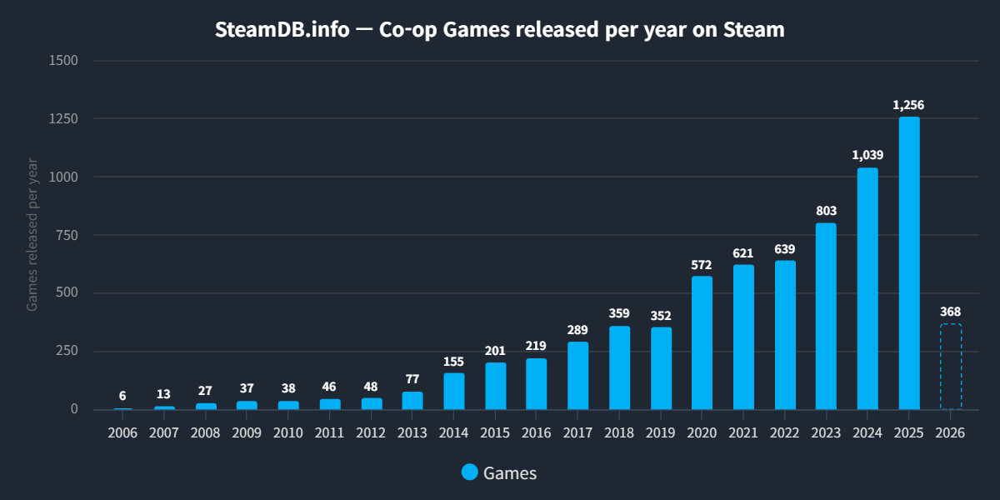
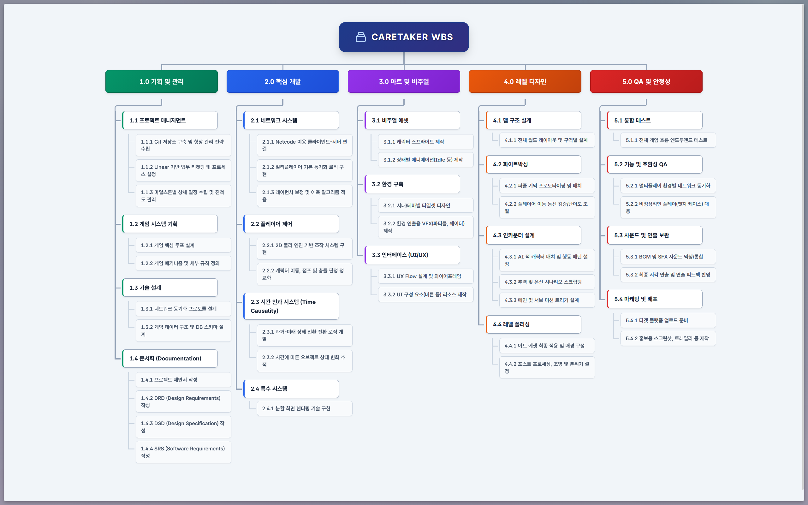
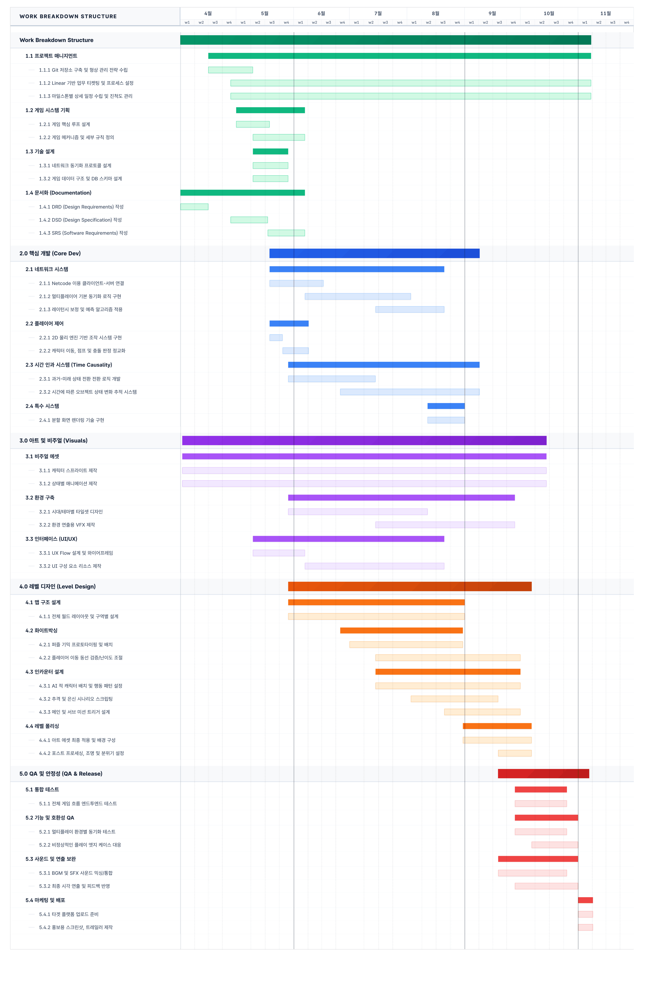

# Caretaker — Design Requirements Document

|   버전   |           내용            | 작업자 |
| :----: | :---------------------: | :-: |
| 260402 |   양식 구성 및 1, 3 문단 작성    | 전원  |
| 260409 |        4~7 문단 작성        | 전원  |
| 260416 | 2, 8~10 문단 작성, 문서 1차 완성 | 전원  |
| 260419 | 문서 구조 변경, Check-Off List, 기술적 설계 과제, 해결방안 비교, 참고자료 정식화. | 유민서 |

---

## 1. 개요

본 프로젝트는 서로 다른 시간대에 존재하는 두 플레이어가 제한된 통신을 통한 정보 교환과 '시간 인과율'을 활용하여 함께 난관을 극복하는 2인 비대칭 협동 퍼즐 어드벤처 PC 게임이다.

기존의 협동 게임들이 대부분 동일한 공간을 공유하며 물리적으로 동행하는 방식에 의존하는 반면, 본 프로젝트는 플레이어들을 시공간적으로 완전히 분리시켜 '정보의 격리'를 의도적으로 발생시킨다. 각 플레이어는 상대방의 화면을 볼 수 없으며 오직 소통을 통해서만 상황을 공유할 수 있다. 이에 더해 과거 플레이어의 행동이 미래 플레이어의 환경에 즉각적인 물리적 변화를 일으키는 '시간 인과 메커니즘'을 결합하여, 단순한 공간 공유를 넘어선 필연적이고 구조적인 협동 경험을 제공한다.

프로젝트는 Unity 6.4 게임 엔진을 기반으로, Netcode for GameObjects 라이브러리를 활용해 Host-Client 방식의 네트워크 멀티플레이 환경을 구축한다. 전체 프로젝트는 6인 팀 체제로 6~8개월에 걸쳐 진행된다. 프로토타입 단계에서는 추격 AI 및 스플릿뷰 연출이 포함된 1개 스테이지(연구소 시나리오, 3개 페이즈)를 우선 구현하여 핵심 재미 요소를 검증하고, 이를 발전시켜 온라인 환경에서 구동 가능한 최종 빌드를 산출하는 것을 목표로 한다.

**팀원 구성:**

| 이름 | 학번 |
|------|------|
| 유민서 | 22311884 |
| 김도경 | 22012139 |
| 김병규 | 22012140 |
| 백승헌 | 22112089 |
| 배원일 | 22313530 |
| 권순표 | 22313552 |

---

## 2. 설계 개요

### 2.1 개발 배경 및 동기

최근 2인 협동 게임 시장은 'It Takes Two'의 GOTY 수상(2021)과 'We Were Here' 시리즈의 범세계적인 흥행(누적 2,000만 다운로드) 등에 힘입어 다양한 연령대에서 광범위한 인기를 누리며 주류 장르로 확고히 자리 잡았다. 이는 함께 난관을 극복하는 과정에서 발생하는 유대감과 긍정적인 스트레스가 유저들에게 매우 매력적인 경험으로 작용하고 있음을 보여준다.

그러나 시장에 출시된 대다수의 협동 게임들은 무대가 되는 시공간을 함께 공유하며 물리적인 동행과 보조적인 역할 수행에 머무르는 경향이 강하다. 플레이어들은 서로의 위치와 상황을 시각적으로 쉽게 확인할 수 있어, 문제 해결 과정에서 역설적으로 '진정한 의미의 정보 교류와 소통의 필요성'이 낮아지는 한계점을 지니고 있다.

본 프로젝트는 이러한 장르적 한계를 극복하고 협동 게임의 상호작용 깊이를 한 단계 더 확장하고자 기획되었다. 플레이어를 두 개의 분리된 시간대로 나누고 상대 화면을 볼 수 없는 '정보 격리 환경'을 구축함으로써, 플레이어 간의 소통을 선택이 아닌 생존과 진행의 '필수 조건'으로 격상시켰다.

나아가 단순히 정보를 교환하는 것을 넘어, 과거의 행동이 미래의 맵 환경 및 퍼즐의 형태를 실시간으로 변화시키는 '시간 인과율' 메커니즘을 핵심 동력으로 도입했다. 이를 통해 물리적으로 동행하지 않아도 서로의 존재를 필연적으로 요구하며 시공간을 초월해 영향을 주고받는, 새롭고 독보적인 형태의 협동 플레이 경험을 선사하고자 한다.

### 2.2 개발 목표

시간 인과율 기반 2인 비대칭 협동 퍼즐 어드벤처의 프로토타입을 완성하고, 핵심 메커니즘의 재미를 검증한다. 프로토타입은 1개 스테이지(연구소 시나리오, 3개 페이즈)로 구성되며, 플레이 테스트를 통해 GO/ITERATE/PIVOT 판정을 수행한다.

### 2.3 시스템 기능

- **시간 인과 환경 변화 시스템**: 과거 플레이어의 행동이 미래 플레이어의 맵 환경을 실시간으로 변화시키는 핵심 메커니즘. 트리거-조건-결과 기반의 데이터 드리븐 구조로 구현.
- **정보 격리 기반 비대칭 플레이**: 두 플레이어는 상대의 화면을 볼 수 없으며, 각자의 시간대(과거/미래)만 플레이한다. 게임 진행에 필요한 정보를 음성 통신을 통해 교환해야 한다.
- **네트워크 멀티플레이**: Netcode for GameObjects 기반 Host-Client 방식. 이벤트 단위 동기화.
- **제한된 통신 시스템**: 게임 내 단방향 무전기를 사용한 정보 교환. 상대의 상황을 직접 볼 수 없으므로 소통의 정확성이 게임 플레이에 직접적으로 영향.
- **감시 및 추격 AI**: 과거의 연구소 경비원, 미래의 AI 드론이 플레이어를 감시·추격. 은신과 상호 협력으로 위기를 모면.
- **분할 화면 연출**: 클라이맥스 페이즈에서 상하 분할 화면으로 양쪽 시간대를 동시에 표시. 실시간 상호 지원 기반의 동시 탈출 시퀀스.

### 2.4 현실적 제한사항

| 제한 분류   | 상세 내용                                  |
| :------ | :------------------------------------- |
| 개발 기간   | 6개월 ~ 8개월 (2026.03 – 2026.11)         |
| 팀 규모    | 6명 (대학생, 파트타임)                         |
| 기술 스택   | Unity 6.4, C#, Netcode for GameObjects |
| 네트워크 환경 | 온라인 연결 필수                              |
| 대상 플랫폼  | PC (Windows)                           |

### 2.5 Specification

| 구현 기능 | 시스템 | 상세 사양 |
| :--- | :--- | :--- |
| **네트워크** | 동기화 기반 | • 최대 허용 Ping: 100ms 이내  • 접속 유효성(Timeout) 만료: 10초 |
| **캐릭터 조작** | 이동 및 물리 | • 기본 이동 속도: 5 units/sec  • 점프 높이: 2 units  • 충돌 판정: 2D Collider (1×2 units) |
| **시간 인과** | 트리거 및 상태 변화 | • 상호작용 가능 반경: 1 unit 이내  • 상태 갱신: 호스트 판정 후 1프레임 이내 클라이언트 전파 |
| **게임 진행** | 페이즈 및 체크포인트 | • 총 3페이즈 (P1: 진입, P2: 탐색, P3: 탈출)  • 체크포인트: 특정 구간 진입 시 자동 저장 |
| **추격 AI** | 감시형 / 추격형 | • 전방 시야 감지 거리: 10 units / 시야각(FOV): 45도 • 어그로 해제 지연: 10초 |
| **연출** | 스플릿뷰 (Phase 3) | • 분할 비율: 5:5 • 동기화: 0프레임 딜레이 (절대 동기) |
| **디스플레이** | 성능 및 화면 | • 60 FPS 고정 • 16:9 비율 최적화 • 전체 화면 및 창모드 지원 |

---

## 3. 경쟁 제품 분석 및 조사

### 3.1 유사 게임 분석

본 프로젝트는 단순한 로컬 협동을 넘어 '비대칭 정보'와 '시간 인과'를 다루므로, 글로벌 플랫폼(Steam)에 출시된 주요 협동 퍼즐 게임들을 분석 대상으로 삼는다.

**3.1.1 We Were Here 시리즈 (정보 비대칭 / 소통 중심)**
무전기를 통해 소통하며 서로 분리된 공간의 퍼즐을 푸는 1인칭 협동 어드벤처. 누적 2,000만 다운로드를 기록하며 소통 중심 퍼즐이라는 새로운 수요를 증명하였다.
*한계: 완전히 같은 시간대에 존재하며, 한쪽의 행동이 상대방의 지형지물에 물리적인 변화를 일으키는 동적 상호작용은 부족하다.*

**3.1.2 Escape Simulator (멀티플레이 퍼즐)**
멀티플레이 기반의 3D 방탈출 게임. 다양한 사물과의 높은 상호작용 및 물리 기반 퍼즐이 특징이다.
*한계: 본질적으로 같은 공간을 공유하므로 정보의 격리가 발생하지 않으며, 실시간 추격 압박이 없다.*

**3.1.3 It Takes Two (비대칭 역할)**
2021년 최다 GOTY를 수상한 게임으로, 두 플레이어에게 서로 다른 능력을 부여하여 상호 보완적인 액션을 유도하는 3D 플랫포머이다.
*한계: 스플릿뷰로 상대의 화면을 항상 볼 수 있어 정보 비대칭성이 전혀 없다.*

**3.1.4 The Past Within — 가장 유사한 경쟁작**
한 플레이어는 과거, 다른 플레이어는 미래에서 단서를 교환하여 미스터리를 푸는 크로스 플랫폼 비대칭 퍼즐 게임이다.
*한계: 포인트 앤 클릭 기반의 정적인 화면으로 진행되어 액션성과 이동의 자유도가 크게 제한된다. 반면 Caretaker는 2D 사이드뷰와 물리 엔진을 결합하여 캐릭터의 이동, 인과에 의한 지형 변화, 적대 AI의 추격 등 훨씬 동적인 플레이를 제공한다.*

**비교표:**

| 구분         | Caretaker | We Were Here | It Takes Two | Escape Simulator | The Past Within |
| :--------- | :-------: | :----------: | :----------: | :--------------: | :-----------------: |
| 정보 비대칭     |     O     |      O       |      X       |        △         |          O          |
| 시간 인과 메커니즘 |     O     |      X       |      X       |        X         |          O          |
| 비대칭 역할     |     O     |      O       |      O       |        X         |          O          |
| 실시간 압박     |     O     |      △       |      O       |        X         |          X          |
| 환경 변화 연동   |     O     |      X       |      O       |        X         |          △          |

### 3.2 관련 문헌 및 선행 연구

**게임 디자인 이론:**
- MDA (Mechanics, Dynamics, Aesthetics) 프레임워크를 기반으로 "소통의 부재"가 플레이어 상호작용 다이내믹스에 미치는 방향성 조사
- 시공간 인과율을 적용한 게임의 레벨 디자인 구조와 인지 모델 분석

**선행 메커니즘 분석:**
- Titanfall 2 "Effect and Cause": 단일 플레이어가 두 시간대를 즉각 전환하는 구조. 본 프로젝트는 이를 2인 협동으로 확장.
- Dishonored 2 "A Crack in the Slab": 과거/현재 시간대 전환을 통한 레벨 디자인.
- Portal 2 Co-op: 상호 의존적 퍼즐 배치에서의 템포 및 거리감 조절 기법 참조.

**차별점:**
기존 시간 인과 게임은 모두 단일 플레이어가 시간을 전환하는 구조이다. 두 플레이어가 각각 다른 시간대에 상주하면서 소통으로 협력하는 구조는 선행 사례가 없으며, 이것이 본 프로젝트의 핵심 차별점이다.

---

## 4. 해결방안 비교

| 결정 사항 | 선택 | 대안 | 선택 근거 |
|---------|------|------|--------|
| 네트워크 | Netcode for GameObjects | Mirror, Photon | Unity 6.4 공식 지원, Host-Client 구조 일치, NetworkVariable이 인과 전파에 적합. 2인 전용이므로 Photon 매치메이킹 이점 미미 |
| 렌더링 | URP (2D) | Built-in RP | 2D Light System으로 시간대별 분위기 연출, 카메라 스태킹으로 Phase 3 분할 화면 구현 가능 |
| 인과 규칙 저장 | ScriptableObject | JSON, Addressables | Unity Inspector에서 직접 편집 가능, 런타임 로드 불필요 |

---

## 5. 시장 현황 및 전망

Steam 플랫폼 기준 "Co-op" 태그 게임의 연간 출시 수와 매출은 지속 성장 중이며, 특히 2인 전용 협동 게임은 It Takes Two GOTY 수상(2021) 이후 주류 장르로 부상하였다. We Were Here 시리즈(누적 2,000만 다운로드)는 소규모 팀으로도 정보 비대칭 협동 퍼즐 장르에서 상업적 성공이 가능함을 입증하였다.

**타겟 플레이어층:** 2인 협동 게임을 즐기는 20~30대 PC 게이머. 특히 "소통 기반 퍼즐"을 선호하는 콘텐츠 크리에이터(유튜버, 스트리머)가 자연적 마케팅 채널이 될 수 있다.

---

## 6. 개발 비용 예측

| 항목 | 상세 | 비용 |
|------|------|------|
| Unity | Personal 라이선스 | ₩0 |
| JetBrains Rider | 학생 라이선스 | ₩0 |
| Slack | Free 플랜 | ₩0 |
| Aseprite | 상용 라이선스 × 1 | ₩20,000 |
| 에셋 구매 | 미확정 | 미정 |
| OpenAI Codex Pro | ₩30,000 × 5개월 | ₩150,000 |
| **합계** | | **₩170,000 + α** |

> 본 프로젝트는 학과 졸업 프로젝트로, 인건비는 발생하지 않는다.

---

## 7. 유통 전략 및 기대 효과

**배포 플랫폼:** Steam 또는 itch.io (무료 / 유료 배포)

**포트폴리오 가치:** 2인 네트워크 협동 게임의 기획, 설계, 구현 전 과정을 경험한 프로젝트로서, 게임 업계 취업 포트폴리오로 활용 가능. 특히 네트워크 동기화, 비대칭 레벨 디자인, 시스템 명세 기반 개발 경험은 차별화 요소.

**기대 효과:**
- 프로토타입 단계에서 핵심 메커니즘의 재미를 검증하여 개발 리스크 최소화
- 명세 기반 개발 프로세스를 통해 팀 협업 역량 강화
- 완성 시 Steam 위시리스트 1,000개 확보를 1차 목표로 설정

---

## 8. Check-Off List

아래 표는 최종 산출물의 완성도를 평가할 수 있는 검증 목록이다.

### 8.1 기능 요구사항 (Functional Requirements)

| ID | 요구사항 | 검증 기준 | 우선순위 | 판정 |
|----|---------|----------|---------|------|
| FR-01 | 두 플레이어가 Host-Client 방식으로 동일 세션에 접속하여 게임을 진행할 수 있다 | 2대 PC에서 세션 생성 → 참가 → 게임 시작 성공 | Must | ☐ |
| FR-02 | 접속 유효성(Timeout) 만료 시 세션 종료 및 사용자 알림 | 10초 무응답 후 타임아웃 UI 표시 확인 | Must | ☐ |
| FR-03 | 일시적 연결 끊김 시 재접속 시도 | 네트워크 차단 후 복구 시 세션 유지 확인 | Should | ☐ |
| FR-04 | 각 플레이어는 자신의 시간대만 볼 수 있다 (정보 격리) | 네트워크 패킷에 상대 렌더링 데이터 미포함 확인 | Must | ☐ |
| FR-05 | 정보 교환은 게임 내 무전기 시스템으로만 가능하다 | 무전기 미사용 시 상대 상황 정보 접근 불가 확인 | Must | ☐ |
| FR-06 | 과거 플레이어의 트리거 활성화 시 미래 맵 환경 변화 반영 | 호스트 판정 후 1프레임 이내 클라이언트 전파 확인 | Must | ☐ |
| FR-07 | 트리거 상호작용은 1 unit 이내에서만 가능 | 1 unit 초과 거리에서 상호작용 불가 확인 | Must | ☐ |
| FR-08 | 시간 인과 규칙은 데이터 드리븐 구조로 정의 | 코드 수정 없이 데이터(SO/JSON)만으로 새 인과 규칙 추가 가능 확인 | Should | ☐ |
| FR-09 | 2D 환경에서 좌우 이동 및 점프 가능 | 이동 속도 5 units/sec, 점프 높이 2 units 측정 | Must | ☐ |
| FR-10 | 캐릭터 충돌 판정 2D Collider (1×2 units) | Inspector 확인 및 충돌 테스트 | Must | ☐ |
| FR-11 | AI가 전방 시야 내 플레이어 감지 시 추격 전환 | 감지 거리 10 units, FOV 45도 이내 진입 시 추격 개시 확인 | Must | ☐ |
| FR-12 | AI가 시야에서 플레이어를 잃은 후 감시 복귀 | 어그로 해제 지연 시간 10초 측정 | Must | ☐ |
| FR-13 | 은신 행동으로 AI 감지 회피 가능 | 은신 상태에서 AI 시야 통과 시 감지 미발생 확인 | Must | ☐ |
| FR-14 | Phase 3에서 분할 화면 렌더링 | 상/하 또는 좌/우 5:5 분할 표시 확인 | Should | ☐ |
| FR-15 | 분할 화면에서 상대 월드 동기화 (0프레임 딜레이) | 동시 이벤트 트리거 후 양쪽 화면 동시 반영 확인 | Should | ☐ |
| FR-16 | 3개 페이즈 (P1: 진입, P2: 탐색, P3: 탈출) 구성 | 각 페이즈 진입/완료 전환 확인 | Must | ☐ |
| FR-17 | 특정 구간 진입 시 체크포인트 자동 저장 | 실패 후 재시작 시 체크포인트에서 재개 확인 | Must | ☐ |

### 8.2 비기능 요구사항 (Non-Functional Requirements)

| ID | 항목 | 요구사항 | 검증 기준 | 판정 |
|----|------|---------|----------|------|
| NFR-01 | 성능 | 60 FPS 고정 유지 | 타깃 사양에서 Profiler 측정, 1% Low ≥ 55 FPS | ☐ |
| NFR-02 | 해상도 | 16:9 최적화, 전체화면/창모드 | 1920×1080, 1280×720에서 UI 깨짐 없음 | ☐ |
| NFR-03 | 지연 | Ping 100ms 이내 | Unity Transport RTT 측정 | ☐ |
| NFR-04 | 타임아웃 | 접속 유효성 만료 10초 | 서버 중단 후 클라이언트 타임아웃 시간 측정 | ☐ |
| NFR-05 | 안정성 | 세션 중 크래시율 < 1% | 10회 완주 테스트 중 크래시 0~1회 | ☐ |

---

## 9. 수행 방법

### 9.1 설계 및 개발 환경

* **대상 OS:** Windows 11
* **네트워크:** Host-Client 기반 온라인 접속
* **개발 환경:** Unity 6.4

### 9.2 설계 및 개발 도구

| 구분 | 도구 |
| :--- | :--- |
| 게임 엔진 | Unity 6.4 |
| 프로그래밍 언어 | C# |
| IDE | Visual Studio Code / JetBrains Rider |
| 네트워크 라이브러리 | Netcode for GameObjects |
| 버전 관리 | Git + GitHub |
| 이슈 관리 | Linear |
| 기획/문서 | Figma, Markdown |
| 커뮤니케이션 | Slack |

---

## 10. 프로젝트 수행 계획

### 10.1 Work Breakdown Structure

### 10.2 Gantt Chart

### 10.3 Linear Responsibility Chart

> 1: 담당자, 2: 보조자, 3: 예비

| 단계 | 항목 | 유민서 | 김도경 | 김병규 | 백승헌 | 배원일 | 권순표 |
| :--- | :--- | :-: | :-: | :-: | :-: | :-: | :-: |
| **1.0** | **기획 및 관리** | | | | | | |
| 1.1 | **프로젝트 매니지먼트** | | | | | | |
| | 1.1.1 Git 저장소 구축 및 형상 관리 전략 수립 | 1 | 3 | 3 | 3 | 2 | 3 |
| | 1.1.2 Linear 기반 업무 티켓팅 및 프로세스 설정 | 1 | 3 | 3 | 3 | 2 | 3 |
| | 1.1.3 마일스톤별 상세 일정 수립 및 진척도 관리 | 1 | 3 | 3 | 3 | 2 | 3 |
| 1.2 | **게임 시스템 기획** | | | | | | |
| | 1.2.1 게임 핵심 루프 설계 | 1 | 3 | 3 | 3 | 3 | 2 |
| | 1.2.2 게임 메커니즘 및 세부 규칙 정의 | 1 | 3 | 3 | 3 | 3 | 2 |
| 1.3 | **기술 설계** | | | | | | |
| | 1.3.1 네트워크 동기화 프로토콜 설계 | 3 | 3 | 3 | 3 | 1 | 2 |
| | 1.3.2 게임 데이터 구조 및 DB 스키마 설계 | 1 | 3 | 3 | 2 | 3 | 3 |
| 1.4 | **문서화** | | | | | | |
| | 1.4.1 프로젝트 제안서 작성 | 1 | 3 | 2 | 3 | 3 | 3 |
| | 1.4.2 DRD 작성 | 1 | 3 | 2 | 3 | 3 | 3 |
| | 1.4.3 DSD 작성 | 1 | 3 | 2 | 3 | 3 | 3 |
| | 1.4.4 SRS 작성 | 1 | 3 | 2 | 3 | 3 | 3 |
| **2.0** | **핵심 개발** | | | | | | |
| 2.1 | **네트워크 시스템** | | | | | | |
| | 2.1.1 Netcode 이용 클라이언트-서버 연결 구축 | 3 | 3 | 3 | 2 | 1 | 3 |
| | 2.1.2 멀티플레이어 기본 동기화 로직 구현 | 3 | 3 | 3 | 2 | 1 | 3 |
| | 2.1.3 레이턴시 보정 및 예측 알고리즘 적용 | 3 | 3 | 3 | 2 | 1 | 3 |
| 2.2 | **플레이어 제어** | | | | | | |
| | 2.2.1 2D 물리 엔진 기반 조작 시스템 구현 | 3 | 3 | 2 | 3 | 3 | 1 |
| | 2.2.2 캐릭터 이동, 점프 및 충돌 판정 정교화 | 3 | 3 | 2 | 3 | 3 | 1 |
| 2.3 | **시간 인과 시스템** | | | | | | |
| | 2.3.1 과거-미래 상태 전환 로직 개발 | 3 | 3 | 3 | 1 | 2 | 3 |
| | 2.3.2 시간에 따른 오브젝트 상태 변화 추적 시스템 | 2 | 3 | 3 | 1 | 3 | 3 |
| 2.4 | **특수 시스템** | | | | | | |
| | 2.4.1 분할 화면 렌더링 기술 구현 | 3 | 3 | 3 | 3 | 2 | 1 |
| **3.0** | **아트 및 비주얼** | | | | | | |
| 3.1 | **비주얼 에셋** | | | | | | |
| | 3.1.1 캐릭터 스프라이트 제작 | 3 | 1 | 2 | 3 | 3 | 3 |
| | 3.1.2 상태별 애니메이션 제작 | 3 | 1 | 2 | 3 | 3 | 3 |
| 3.2 | **환경 구축** | | | | | | |
| | 3.2.1 시대/테마별 타일셋 디자인 | 3 | 1 | 3 | 2 | 3 | 3 |
| | 3.2.2 환경 연출용 VFX 제작 | 3 | 1 | 3 | 2 | 3 | 3 |
| 3.3 | **인터페이스 (UI/UX)** | | | | | | |
| | 3.3.1 UX Flow 설계 및 와이어프레임 | 3 | 2 | 1 | 3 | 3 | 3 |
| | 3.3.2 UI 구성 요소 리소스 제작 | 3 | 1 | 3 | 2 | 3 | 3 |
| **4.0** | **레벨 디자인** | | | | | | |
| 4.1 | **맵 구조 설계** | | | | | | |
| | 4.1.1 전체 월드 레이아웃 및 레벨 설계 | 2 | 3 | 1 | 3 | 3 | 3 |
| 4.2 | **화이트박싱** | | | | | | |
| | 4.2.1 퍼즐 기믹 프로토타이핑 및 배치 | 2 | 3 | 1 | 3 | 3 | 3 |
| | 4.2.2 플레이어 이동 동선 검증 및 난이도 조절 | 2 | 3 | 1 | 3 | 3 | 3 |
| 4.3 | **인카운터 설계** | | | | | | |
| | 4.3.1 AI 적 캐릭터 배치 및 패턴 설정 | 3 | 3 | 3 | 1 | 3 | 2 |
| | 4.3.2 추격 및 은신 시나리오 스크립팅 | 3 | 3 | 3 | 1 | 3 | 2 |
| | 4.3.3 메인 및 서브 미션 트리거 설계 | 2 | 3 | 3 | 1 | 3 | 3 |
| 4.4 | **레벨 폴리싱** | | | | | | |
| | 4.4.1 아트 에셋 최종 적용 및 배경 구성 | 3 | 1 | 3 | 3 | 2 | 3 |
| | 4.4.2 포스트 프로세싱, 조명 및 분위기 설정 | 3 | 3 | 1 | 3 | 2 | 3 |
| **5.0** | **QA 및 안정성** | | | | | | |
| 5.1 | **통합 테스트** | | | | | | |
| | 5.1.1 전체 게임 흐름 엔드투엔드 테스트 | 2 | 3 | 3 | 3 | 3 | 1 |
| 5.2 | **기능 및 호환성 QA** | | | | | | |
| | 5.2.1 네트워크 동기화 테스트 | 3 | 3 | 3 | 3 | 1 | 2 |
| | 5.2.2 엣지 케이스 대응 테스트 | 3 | 2 | 3 | 3 | 3 | 1 |
| 5.3 | **사운드 및 연출 보완** | | | | | | |
| | 5.3.1 BGM 및 SFX 사운드 믹싱/통합 | 3 | 2 | 1 | 3 | 3 | 3 |
| | 5.3.2 최종 시각 연출 및 피드백 반영 | 3 | 2 | 3 | 1 | 3 | 3 |
| 5.4 | **마케팅 및 배포** | | | | | | |
| | 5.4.1 타겟 플랫폼 업로드 준비 | 3 | 2 | 3 | 3 | 1 | 3 |
| | 5.4.2 홍보용 리소스 및 설명 자료 제작 | 3 | 2 | 3 | 3 | 3 | 1 |

---

## 11. 참고 자료

1. Unity Technologies. *Unity 6 Documentation*. https://docs.unity3d.com/6000.0/Documentation/Manual/
2. Unity Technologies. *Netcode for GameObjects Documentation*. https://docs-multiplayer.unity3d.com/netcode/current/about/