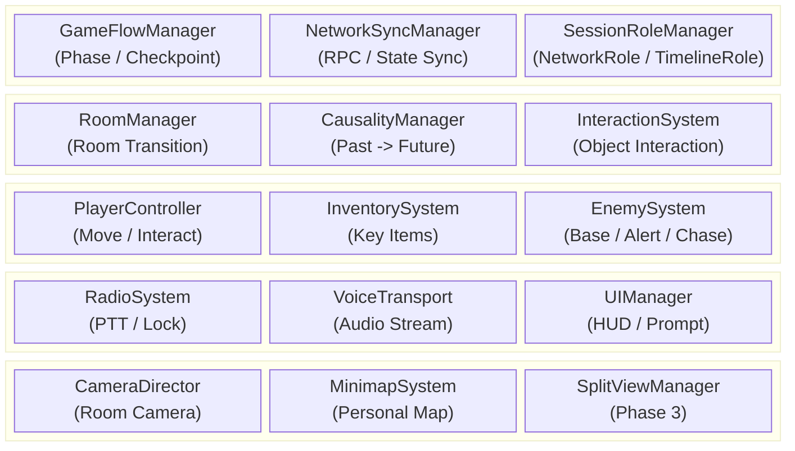
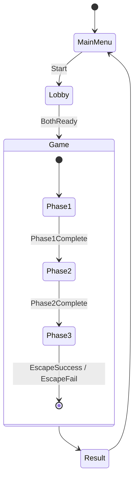
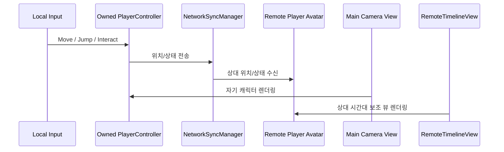
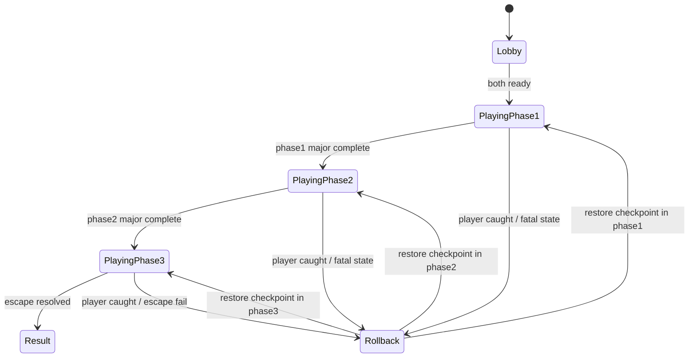
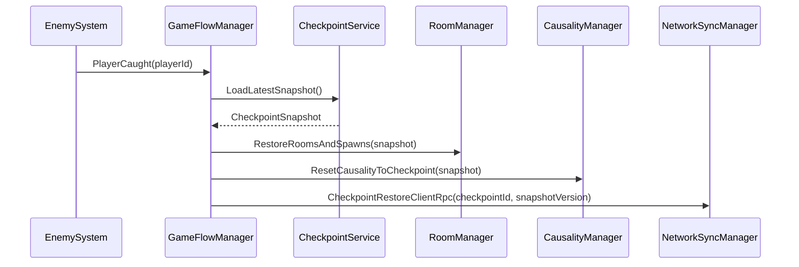

# Caretaker DSD — Part 1: 요약문 / 서론 / 시스템 설계

> 본 파일은 DSD를 팀원별로 분할한 파트입니다. 최종적으로 `DSD.md`에 병합됩니다.

---

# Caretaker — Design Specification Document

| 버전 | 내용 | 작업자 |
| :---: | :--- | :---: |
| 260507 | DSD 초안 구조 정리 | 유민서 |
| 260510 | DSD 작성 | 전원 |
| 260514 | DSD 작성 | 전원 |

> 본 문서는 6월 프로토타입 기준의 소프트웨어 설계 명세서다. 세부 시나리오와 레벨 디자인은 시스템 설계에 필요한 예시 수준으로만 다루며, 핵심 기능의 구조, 모듈, 인터페이스, 데이터, 동기화 흐름을 명세한다.

---

## 개요 / 바로가기

| 구분 | 바로가기 | 목적 |
| :--- | :--- | :--- |
| 문서 요약 | [요약문](#요약문) | 목적, 기술 스택, 제품 요약 확인 |
| 기본 전제 | [1. 서론](#1-서론) | 범위, 용어, 참조 문서, 주요 사양 확인 |
| 전체 구조 | [2. 시스템 설계](#2-시스템-설계) | 전체 아키텍처, 시스템 의존성, 상태 흐름, 설계 원칙 확인 |
| 세부 시스템 | [3. 세부 설계](#3-세부-설계) | 인과, 네트워크, 플레이어, 룸, AI, 무전기, 인벤토리, 스플릿뷰, 체크포인트, UI 설계 확인 |
| 데이터 / 메시지 | [4. 데이터 설계](#4-데이터-설계) | ScriptableObject, Runtime State, 네트워크 메시지 계약, ID 규칙 확인 |
| 요구사항 검증 | [5. 요구사항 추적 매트릭스](#5-요구사항-추적-매트릭스) | DRD 요구사항 매핑, 리스크, 핵심 설계 계약 검증 확인 |
| 참고 자료 | [6. 참고 자료](#6-참고-자료) | 문서 작성에 사용한 외부 기준 확인 |

**핵심 설계 바로가기**

| 항목 | 바로가기 |
| :--- | :--- |
| 시간 인과 시스템 | [3.1 시간 인과 시스템](#31-시간-인과-시스템) |
| 네트워크 공개 범위 | [3.2 네트워크 동기화 시스템](#32-네트워크-동기화-시스템) |
| Phase 3 스플릿뷰 | [3.8 Phase 3 스플릿뷰 시스템](#38-phase-3-스플릿뷰-시스템) |
| 네트워크 메시지 계약 | [4.4 네트워크 메시지](#44-네트워크-메시지) |
| 핵심 설계 계약 검증 | [5.4 핵심 설계 계약 검증](#54-핵심-설계-계약-검증) |

---

## 요약문

**목적**

본 문서는 Caretaker 프로토타입의 핵심 기능을 구현하기 위한 소프트웨어 설계를 정의한다. DRD에서 제시한 요구사항을 시스템 단위로 분해하고, 각 시스템의 책임, 주요 컴포넌트, 인터페이스, 데이터 구조, 네트워크 동기화 방식을 명세하여 개발 기준으로 사용한다.

**관련 기술**

| 기술 | 상세 |
| :--- | :--- |
| Unity 6.4 | 2D 게임 엔진 및 URP 2D 렌더링 |
| C# | 게임 로직 구현 언어 |
| Netcode for GameObjects | 2인 Host-Client 네트워크 동기화 |
| Unity Input System | 키보드/마우스 입력 처리 |
| ScriptableObject | 인과 규칙, 적 파라미터, 아이템 등 데이터 정의 |

**제품 요약**

Caretaker는 과거와 미래에 분리된 두 플레이어가 제한된 정보와 인게임 무전기 통신을 통해 협력하는 2인 비대칭 협동 퍼즐 어드벤처 게임이다. 프로토타입은 하나의 연구소 스테이지와 3개 페이즈로 구성되며, 과거 플레이어의 행동이 미래 플레이어의 환경을 즉시 변화시키는 시간 인과 시스템을 핵심으로 한다.

---

## 1. 서론

### 1.1 개요

프로토타입은 연구소 스테이지 1개를 대상으로 한다. 두 플레이어는 각각 과거와 미래의 동일한 병렬 시설에 배치되며, Phase 1~2에서는 상대 화면을 볼 수 없다. 플레이어는 인게임 half-duplex 무전기를 통해 정보를 교환하고, 과거에서 발생한 물리적 인과가 미래 월드 상태를 즉시 변경한다. Phase 3에서는 예외적으로 상하 스플릿뷰를 사용해 서로 다른 시간대의 탈출 경로를 동시에 보여준다.

### 1.2 용어 정의

| 용어 | 정의 |
| :--- | :--- |
| 프로토타입 | 6월 둘째 주까지 제작할 연구소 1스테이지 기준 플레이 가능 버전 |
| 스테이지 | 3개 페이즈로 구성된 하나의 완전한 연구소 플레이 공간 |
| 페이즈 | 스테이지 내부의 큰 진행 구간. Phase 1, Phase 2, Phase 3로 구분 |
| 시간대 역할 | 플레이어의 게임 역할. Past 또는 Future |
| 네트워크 역할 | 세션 권한 역할. Host 또는 Client |
| 정보 격리 | 플레이어가 상대의 상태, 위치, 화면, 단서, 진행 정보를 시스템 화면이나 UI로 직접 알 수 없고, 인게임 무전기 대화로만 공유받는 플레이 경험 규칙 |
| 복제 필터링 | 정보 격리를 보장하기 위해 Phase 1~2에서 상대 위치, 룸, 방문 기록, 아바타 상태, 단서 상태를 비소유 Client에 전송하지 않는 네트워크 정책 |
| 표시 필터링 | 수신한 상태 중 로컬 플레이어에게 허용된 정보만 HUD, 미니맵, 프롬프트에 노출하는 UI 정책 |
| 물리적 인과 | 과거 행동이 미래 월드의 물리 상태를 바꾸는 단방향 인과 |
| Major Interaction | 두 플레이어가 같은 단기 목표를 위해 반드시 상호 의존해야 하는 주요 협동 상호작용 |
| Minor Interaction | 짧지만 결과를 명확히 인지할 수 있는 보조 인과 상호작용 |
| 룸 | 방, 복도, 계단 등 플레이와 카메라 전환의 기본 공간 단위 |
| 경보 상태 | 발각 후 현재 방과 인접 방의 적이 강화 감시 상태로 전환되는 상태 |
| 공동 실패 | 한 플레이어의 실패가 양쪽 플레이어의 체크포인트 복귀로 이어지는 규칙 |

### 1.3 참조 문서

| 문서 | 경로 |
| :--- | :--- |
| DRD | [`../DRD.md`](../DRD.md) |
| 레벨 디자인 가이드 | [`../meetings/260504-level-design-guide.md`](../meetings/260504-level-design-guide.md) |

### 1.4 설계 제한사항

| 제한 분류 | 설계 반영 |
| :--- | :--- |
| 2인 전용 | 모든 네트워크/역할/동기화 구조는 2인 Host-Client를 기준으로 한다. |
| PC 전용 | 키보드/마우스 입력을 우선 지원한다. |
| 2D 사이드뷰 | 2D Rigidbody/Collider, URP 2D 카메라, 2D Raycast를 기준으로 한다. |
| 정보 격리 | Phase 1~2에서 상대 정보는 무전기 대화로만 알 수 있어야 하며, 복제 필터링과 표시 필터링으로 이를 보장한다. |
| 프로토타입 우선 | 가능한 핵심 시스템을 먼저 명세하고, 구현 리스크는 별도 검토 대상으로 둔다. |

### 1.5 주요 사양

| 항목 | 사양 |
| :--- | :--- |
| 플레이 인원 | 2명 |
| 네트워크 구조 | Host-Client |
| 시간대 역할 | Past / Future 고정 |
| 물리적 인과 방향 | Past → Future |
| 인과 반영 | 즉시 반영 |
| 통신 방식 | 인게임 Push-to-Talk, half-duplex |
| 캐릭터 이동 속도 | 5 units/sec |
| 점프 높이 | 2 units |
| 상호작용 반경 | 1 unit |
| 기본 AI 감지 거리 / FOV | 10 units / 45도 |
| 목표 프레임레이트 | 60 FPS |
| 화면 비율 | 16:9 |

---

## 2. 시스템 설계

### 2.1 전체 아키텍처

### 2.2 시스템 간 의존성

| 발신 시스템 | 수신 시스템 | 데이터 / 이벤트 | 목적 |
| :--- | :--- | :--- | :--- |
| PlayerController | InteractionSystem | `InteractionRequest` | 오브젝트 조사, 사용, 아이템 적용 요청 |
| InteractionSystem | CausalityManager | `CausalTriggerRequest` | 과거 트리거 활성화 요청 |
| CausalityManager | NetworkSyncManager | `CausalStateChanged` | 미래 월드 상태 변경 동기화 |
| CausalityManager | RoomManager | `ApplyReceiverState` | 미래 리시버 상태 반영 |
| EnemySystem | GameFlowManager | `PlayerCaught` | 공동 실패 및 체크포인트 복귀 |
| EnemySystem | RoomManager | `AlertRoomsRequested` | 현재 방 및 인접 방 경계 상태 전파 |
| RadioSystem | NetworkSyncManager | `RadioLockStateChanged` | 송신권 상태 동기화 |
| VoiceTransport | RadioSystem | `VoiceFrame` | 송신권 보유 중 음성 전송 |
| GameFlowManager | SplitViewManager | `Phase3Started` | Phase 3 스플릿뷰 활성화 |
| RoomManager | MinimapSystem | `RoomVisited` | 개인 방문 기반 미니맵 갱신 |

### 2.3 씬 및 상태 흐름

### 2.4 설계 원칙

| 원칙 | 설명 |
| :--- | :--- |
| Host Authority | 게임 진행, 인과, 실패, 경보 판정은 Host가 권위 있게 처리한다. |
| Event-Based Sync | 모든 상태를 매 프레임 동기화하지 않고, 상호작용/인과/경보/체크포인트 이벤트 단위로 전파한다. |
| Data-Driven Rules | 인과 규칙, 적 파라미터, 방 연결, 체크포인트는 데이터로 정의한다. |
| Role Separation | Host/Client와 Past/Future를 분리하여 네트워크 권한과 게임 역할을 혼동하지 않는다. |
| Room-Scoped Pressure | Phase 1~2의 직접 추적은 방 단위로 제한하고, 경보는 인접 방까지 전파한다. |

---

### 3.8 Phase 3 스플릿뷰 시스템

**책임**

- Phase 3에서 상하 5:5 스플릿뷰를 활성화한다.
- 상대 화면 영상을 네트워크로 송수신하지 않고, 양쪽 시간대 화면을 각 클라이언트가 로컬에서 렌더링한다.
- 각 클라이언트는 자기 캐릭터를 추적하는 메인 카메라 제어권을 유지하고, 상대 시간대는 읽기 전용 보조 뷰로 렌더링한다.
- 양쪽 시간대 화면을 같은 UI에 표시하되, 입력은 자기 캐릭터에만 적용한다.
- Phase 1~2의 정보 격리 규칙에 대한 예외를 명시적으로 GameFlow에서만 열 수 있게 한다.
- 상대 상태 복제는 Phase 3 전환 요청 직후가 아니라 양쪽 클라이언트가 준비 완료를 보고한 뒤 Host가 시작 이벤트를 발행하는 시점에만 허용한다.

**기술 설명**

Phase 3 스플릿뷰는 영상 스트리밍 기능이 아니다. 각 클라이언트는 Phase 3에 필요한 Past/Future 탈출 경로, 플레이어 아바타, 장애물, 인과 상태를 로컬에 로드하고, 네트워크로 수신한 상태 데이터만 사용해 자기 화면을 구성한다. 즉 네트워크는 픽셀 프레임을 전송하지 않고, 위치/상태/이벤트만 동기화한다.

스플릿뷰 렌더링은 `메인 카메라 + 읽기 전용 보조 뷰` 구조를 사용한다. 자기 시간대는 기존 메인 카메라가 계속 추적하고, 상대 시간대는 보조 카메라가 `RenderTexture`에 렌더링한 뒤 UI 영역에 표시한다. 보조 뷰는 Presentation 전용 출력이며 입력 권한, 카메라 흔들림, 줌, 타겟 전환 같은 게임 카메라 제어권을 갖지 않는다.

| 구분 | 방식 | 네트워크 부하 |
| :--- | :--- | :--- |
| 잘못된 접근 | 상대 카메라 영상을 캡처해 실시간 송출/수신 | 매우 큼. 해상도와 FPS에 비례 |
| 채택 접근 | 자기 메인 카메라를 유지하고, 상대 시간대는 상태 데이터 기반 RenderTexture 보조 뷰로 로컬 렌더링 | 작음. 위치, 상태, 이벤트만 전송 |

Phase 3 전환 시 각 클라이언트는 탈출 경로, 카메라, 보조 뷰 준비를 마친 뒤 준비 완료를 Host에 보고한다. `GameFlowManager`는 양쪽 준비가 확인된 뒤 `Phase3Started` 이벤트를 발행한다. 각 클라이언트의 `SplitViewManager`는 이 이벤트를 받아 자기 시간대 메인 카메라의 UI 표시 영역을 조정하고, 상대 시간대 보조 카메라를 활성화해 `RenderTexture`에 출력한다. UI는 메인 카메라 출력과 보조 뷰 출력을 상하 5:5 영역에 배치한다.

| 출력 | 렌더링 대상 | 표시 방식 | 제어권 |
| :--- | :--- | :--- | :--- |
| 자기 시간대 메인 뷰 | 로컬 플레이어의 시간대 경로, 자기 캐릭터, 해당 시간대 오브젝트 | 기존 메인 카메라 출력을 스플릿뷰 UI 영역에 배치 | 로컬 플레이어 카메라 제어권 보유 |
| 상대 시간대 보조 뷰 | 상대 시간대 경로, 상대 캐릭터, 상대 시간대 오브젝트 | 보조 카메라가 `RenderTexture`로 렌더링 후 UI에 표시 | 읽기 전용. 입력/게임 카메라 제어권 없음 |

**동기화 데이터**

| 데이터 | 동기화 방식 | 설명 |
| :--- | :--- | :--- |
| 플레이어 위치/상태 | `NetworkTransform` 또는 상태 이벤트 | 상대 플레이어 아바타를 로컬에서 표시하기 위한 최소 상태 |
| Phase 3 준비/시작/종료 | Client 준비 보고 + Host 권위 상태 이벤트 | 양쪽 클라이언트가 같은 진행 상태에서 스플릿뷰와 상대 최소 상태 복제를 활성화 |
| 장애물/인과 상태 | 이벤트 기반 RPC | 과거 행동으로 미래 경로가 열리거나 막히는 결과 반영 |
| 실패/성공 판정 | Host 권위 이벤트 | 한쪽 실패 시 공동 실패 처리 |
| 카메라 영상 | 동기화하지 않음 | 각 클라이언트가 로컬에서 직접 렌더링 |

**입력 소유권**

스플릿뷰에서는 양쪽 시간대가 모두 보이지만, 입력 시스템은 로컬 플레이어가 소유한 `PlayerController`에만 입력 이벤트를 전달한다. 상대 플레이어 캐릭터는 네트워크 상태를 따라 움직이는 원격 아바타로 보조 뷰에 렌더링되며, 로컬 입력을 받지 않는다. 따라서 화면에 두 캐릭터가 보이더라도 조작 권한은 기존 Past/Future 역할 고정 규칙을 따른다.

**구성 요소**

| 요소 | 계층 | 설명 |
| :--- | :--- | :--- |
| `SplitViewManager` | Unity Component | 카메라 rect, viewport, UI anchor 변경 |
| `TimelineCameraRig` | Unity Component | 자기 시간대 메인 카메라 추적 대상 |
| `RemoteTimelineView` | Unity Component | 상대 시간대 보조 카메라와 RenderTexture 출력 관리 |
| `SplitViewState` | Runtime State | 활성 여부, 분할 방향, 각 카메라 대상 |
| `PhasePresentationSO` | Data Asset | Phase별 카메라/연출 설정 |

**인터페이스**

| Name | Input | Process | Output | Authority |
| :--- | :--- | :--- | :--- | :--- |
| `EnableSplitView` | phase id, local target, remote target | 메인 뷰 UI 영역 조정, 상대 보조 뷰 RenderTexture 활성화 | split active | Host event, Client local render |
| `DisableSplitView` | reason | 보조 뷰 비활성화, 메인 카메라 단일 화면 복귀 | split inactive | Host event |
| `RouteInputToOwner` | input action, local player id | 로컬 소유 캐릭터만 조작 | player command | Owner Client |

**리스크**

- DRD의 "0프레임 딜레이"는 네트워크 물리 동기화의 문자 그대로의 보장이 아니라 같은 Host tick 결과를 같은 프레임에 렌더링하는 목표로 해석한다. 구현 검증 시 동일 이벤트의 표시 프레임 차이를 측정한다.

### 3.9 게임 진행 / 체크포인트 시스템

**책임**

- Phase 전환, Major Interaction 완료 판정, 공동 실패, 체크포인트 저장/복귀를 관리한다.
- 실패와 연결 끊김 이후 복원 가능한 최소 상태를 정의한다.

**구성 요소**

| 요소 | 계층 | 설명 |
| :--- | :--- | :--- |
| `GameFlowManager` | Network Boundary / Unity Component | 게임 상태 전이와 RPC 전파 |
| `PhaseService` | Domain Service | Phase 완료 조건과 다음 Phase 계산 |
| `CheckpointService` | Domain Service | 스냅샷 생성/복원 |
| `CheckpointDefinitionSO` | Data Asset | 체크포인트 ID, 스폰, 초기 룸, 복원 정책 |
| `GameSessionState` | Runtime State | 현재 Phase, 체크포인트, 공동 실패 상태 |
| `CheckpointSnapshot` | Runtime State | 플레이어, 인벤토리, 인과, 룸, AI 상태 스냅샷 |

**상태 흐름**

**체크포인트 복귀 흐름**

**인터페이스**

| Name | Input | Process | Output | Authority |
| :--- | :--- | :--- | :--- | :--- |
| `NotifyMajorComplete` | phase id, major id | 완료 목록 갱신, Phase 완료 조건 검사 | phase progress | Host |
| `CreateCheckpoint` | checkpoint id | 현재 RuntimeState 스냅샷 생성 | `CheckpointSnapshot` | Host |
| `RollbackToCheckpoint` | failure reason | 플레이어/룸/인과/AI/인벤토리 복원 | restored state | Host |
| `TransitionPhase` | target phase | 데이터 로드, 카메라/UI/스플릿뷰 이벤트 발행 | phase started | Host |
| `HandleSessionTimeout` | disconnected client id | 일시 정지 또는 종료 정책 적용 | recovery UI | Host |

### 3.10 UI / HUD 시스템

**책임**

- 정보 격리 규칙을 UI에도 적용한다.
- 상호작용 프롬프트, 무전기 상태, 인벤토리, 개인 미니맵, 단기 목표를 표시한다.
- 실제 인과 변경 발생 시 양쪽 플레이어에게 공통 `CausalityIndicator`를 추상 피드백으로 표시한다.
- Phase 진행 상태는 내부 진행 관리 정보로만 사용하며 UI에 직접 표시하지 않는다.
- UI는 권위 판정을 하지 않고 로컬 표시와 입력 보조만 담당한다.

**구성 요소**

| 요소 | 계층 | 설명 |
| :--- | :--- | :--- |
| `HudPresenter` | Unity Component | HUD 상태를 ViewModel로 렌더링 |
| `InteractionPromptPresenter` | Unity Component | 근접/E키/클릭 프롬프트 표시 |
| `InventoryPresenter` | Unity Component | 개인 인벤토리와 선택 아이템 표시 |
| `MinimapPresenter` | Unity Component | 방문한 개인 룸만 표시 |
| `ObjectivePresenter` | Unity Component | 현재 단기 목표와 체크포인트 알림 표시 |
| `CausalityIndicatorPresenter` | Unity Component | 인과 변경 발생을 점멸/회전/파동 등 추상 UI로 표시 |
| `HudViewModelBuilder` | Domain Service | RuntimeState를 표시 가능한 ViewModel로 변환 |

**인터페이스**

| Name | Input | Process | Output | Authority |
| :--- | :--- | :--- | :--- | :--- |
| `BuildHudViewModel` | local player state, allowed replicated state | 정보 격리 필터 적용 | HUD view model | Client local |
| `ShowInteractionPrompt` | nearby interactable, selected item | 가능한 행동 라벨 결정 | prompt state | Client local |
| `ShowCausalityPulse` | pulse event | 구체 상태 정보 없이 공통 인과 아이콘 애니메이션 표시 | pulse animation | Client local |
| `ShowCheckpointNotice` | checkpoint event | 알림 표시 | toast / banner | Client local |
| `ShowConnectionWarning` | timeout/reconnect state | 네트워크 상태 표시 | warning modal | Client local |

---
