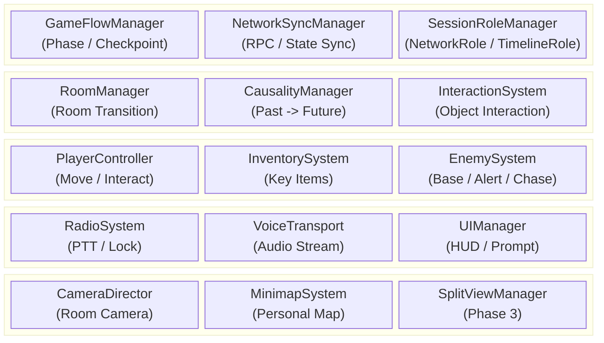
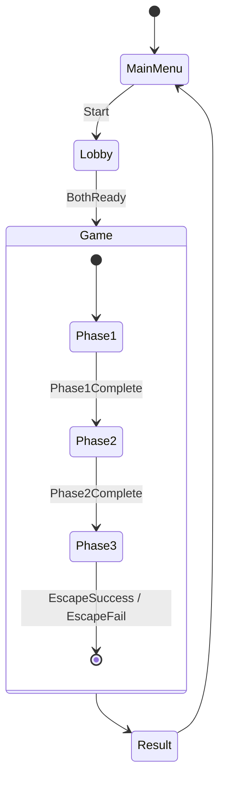

# Caretaker DSD — Part 1: 요약문 / 서론 / 시스템 설계

> 본 파일은 DSD를 팀원별로 분할한 파트입니다. 최종적으로 `DSD.md`에 병합됩니다.

---

# Caretaker — Design Specification Document

| 버전 | 내용 | 작업자 |
| :---: | :--- | :---: |
| 260507 | DSD 초안 구조 정리 | 유민서 |
| 260510 | DSD 작성 | 전원 |
| 260514 | DSD 작성 | 전원 |

> 본 문서는 6월 프로토타입 기준의 소프트웨어 설계 명세서다. 세부 시나리오와 레벨 디자인은 시스템 설계에 필요한 예시 수준으로만 다루며, 핵심 기능의 구조, 모듈, 인터페이스, 데이터, 동기화 흐름을 명세한다.

---

## 개요 / 바로가기

| 구분 | 바로가기 | 목적 |
| :--- | :--- | :--- |
| 문서 요약 | [요약문](#요약문) | 목적, 기술 스택, 제품 요약 확인 |
| 기본 전제 | [1. 서론](#1-서론) | 범위, 용어, 참조 문서, 주요 사양 확인 |
| 전체 구조 | [2. 시스템 설계](#2-시스템-설계) | 전체 아키텍처, 시스템 의존성, 상태 흐름, 설계 원칙 확인 |
| 세부 시스템 | [3. 세부 설계](#3-세부-설계) | 인과, 네트워크, 플레이어, 룸, AI, 무전기, 인벤토리, 스플릿뷰, 체크포인트, UI 설계 확인 |
| 데이터 / 메시지 | [4. 데이터 설계](#4-데이터-설계) | ScriptableObject, Runtime State, 네트워크 메시지 계약, ID 규칙 확인 |
| 요구사항 검증 | [5. 요구사항 추적 매트릭스](#5-요구사항-추적-매트릭스) | DRD 요구사항 매핑, 리스크, 핵심 설계 계약 검증 확인 |
| 참고 자료 | [6. 참고 자료](#6-참고-자료) | 문서 작성에 사용한 외부 기준 확인 |

**핵심 설계 바로가기**

| 항목 | 바로가기 |
| :--- | :--- |
| 시간 인과 시스템 | [3.1 시간 인과 시스템](#31-시간-인과-시스템) |
| 네트워크 공개 범위 | [3.2 네트워크 동기화 시스템](#32-네트워크-동기화-시스템) |
| Phase 3 스플릿뷰 | [3.8 Phase 3 스플릿뷰 시스템](#38-phase-3-스플릿뷰-시스템) |
| 네트워크 메시지 계약 | [4.4 네트워크 메시지](#44-네트워크-메시지) |
| 핵심 설계 계약 검증 | [5.4 핵심 설계 계약 검증](#54-핵심-설계-계약-검증) |

---

## 요약문

**목적**

본 문서는 Caretaker 프로토타입의 핵심 기능을 구현하기 위한 소프트웨어 설계를 정의한다. DRD에서 제시한 요구사항을 시스템 단위로 분해하고, 각 시스템의 책임, 주요 컴포넌트, 인터페이스, 데이터 구조, 네트워크 동기화 방식을 명세하여 개발 기준으로 사용한다.

**관련 기술**

| 기술 | 상세 |
| :--- | :--- |
| Unity 6.4 | 2D 게임 엔진 및 URP 2D 렌더링 |
| C# | 게임 로직 구현 언어 |
| Netcode for GameObjects | 2인 Host-Client 네트워크 동기화 |
| Unity Input System | 키보드/마우스 입력 처리 |
| ScriptableObject | 인과 규칙, 적 파라미터, 아이템 등 데이터 정의 |

**제품 요약**

Caretaker는 과거와 미래에 분리된 두 플레이어가 제한된 정보와 인게임 무전기 통신을 통해 협력하는 2인 비대칭 협동 퍼즐 어드벤처 게임이다. 프로토타입은 하나의 연구소 스테이지와 3개 페이즈로 구성되며, 과거 플레이어의 행동이 미래 플레이어의 환경을 즉시 변화시키는 시간 인과 시스템을 핵심으로 한다.

---

## 1. 서론

### 1.1 개요

프로토타입은 연구소 스테이지 1개를 대상으로 한다. 두 플레이어는 각각 과거와 미래의 동일한 병렬 시설에 배치되며, Phase 1~2에서는 상대 화면을 볼 수 없다. 플레이어는 인게임 half-duplex 무전기를 통해 정보를 교환하고, 과거에서 발생한 물리적 인과가 미래 월드 상태를 즉시 변경한다. Phase 3에서는 예외적으로 상하 스플릿뷰를 사용해 서로 다른 시간대의 탈출 경로를 동시에 보여준다.

### 1.2 용어 정의

| 용어 | 정의 |
| :--- | :--- |
| 프로토타입 | 6월 둘째 주까지 제작할 연구소 1스테이지 기준 플레이 가능 버전 |
| 스테이지 | 3개 페이즈로 구성된 하나의 완전한 연구소 플레이 공간 |
| 페이즈 | 스테이지 내부의 큰 진행 구간. Phase 1, Phase 2, Phase 3로 구분 |
| 시간대 역할 | 플레이어의 게임 역할. Past 또는 Future |
| 네트워크 역할 | 세션 권한 역할. Host 또는 Client |
| 정보 격리 | 플레이어가 상대의 상태, 위치, 화면, 단서, 진행 정보를 시스템 화면이나 UI로 직접 알 수 없고, 인게임 무전기 대화로만 공유받는 플레이 경험 규칙 |
| 복제 필터링 | 정보 격리를 보장하기 위해 Phase 1~2에서 상대 위치, 룸, 방문 기록, 아바타 상태, 단서 상태를 비소유 Client에 전송하지 않는 네트워크 정책 |
| 표시 필터링 | 수신한 상태 중 로컬 플레이어에게 허용된 정보만 HUD, 미니맵, 프롬프트에 노출하는 UI 정책 |
| 물리적 인과 | 과거 행동이 미래 월드의 물리 상태를 바꾸는 단방향 인과 |
| Major Interaction | 두 플레이어가 같은 단기 목표를 위해 반드시 상호 의존해야 하는 주요 협동 상호작용 |
| Minor Interaction | 짧지만 결과를 명확히 인지할 수 있는 보조 인과 상호작용 |
| 룸 | 방, 복도, 계단 등 플레이와 카메라 전환의 기본 공간 단위 |
| 경보 상태 | 발각 후 현재 방과 인접 방의 적이 강화 감시 상태로 전환되는 상태 |
| 공동 실패 | 한 플레이어의 실패가 양쪽 플레이어의 체크포인트 복귀로 이어지는 규칙 |

### 1.3 참조 문서

| 문서 | 경로 |
| :--- | :--- |
| DRD | [`../DRD.md`](../DRD.md) |
| 레벨 디자인 가이드 | [`../meetings/260504-level-design-guide.md`](../meetings/260504-level-design-guide.md) |

### 1.4 설계 제한사항

| 제한 분류 | 설계 반영 |
| :--- | :--- |
| 2인 전용 | 모든 네트워크/역할/동기화 구조는 2인 Host-Client를 기준으로 한다. |
| PC 전용 | 키보드/마우스 입력을 우선 지원한다. |
| 2D 사이드뷰 | 2D Rigidbody/Collider, URP 2D 카메라, 2D Raycast를 기준으로 한다. |
| 정보 격리 | Phase 1~2에서 상대 정보는 무전기 대화로만 알 수 있어야 하며, 복제 필터링과 표시 필터링으로 이를 보장한다. |
| 프로토타입 우선 | 가능한 핵심 시스템을 먼저 명세하고, 구현 리스크는 별도 검토 대상으로 둔다. |

### 1.5 주요 사양

| 항목 | 사양 |
| :--- | :--- |
| 플레이 인원 | 2명 |
| 네트워크 구조 | Host-Client |
| 시간대 역할 | Past / Future 고정 |
| 물리적 인과 방향 | Past → Future |
| 인과 반영 | 즉시 반영 |
| 통신 방식 | 인게임 Push-to-Talk, half-duplex |
| 캐릭터 이동 속도 | 5 units/sec |
| 점프 높이 | 2 units |
| 상호작용 반경 | 1 unit |
| 기본 AI 감지 거리 / FOV | 10 units / 45도 |
| 목표 프레임레이트 | 60 FPS |
| 화면 비율 | 16:9 |

---

## 2. 시스템 설계

### 2.1 전체 아키텍처

### 2.2 시스템 간 의존성

| 발신 시스템 | 수신 시스템 | 데이터 / 이벤트 | 목적 |
| :--- | :--- | :--- | :--- |
| PlayerController | InteractionSystem | `InteractionRequest` | 오브젝트 조사, 사용, 아이템 적용 요청 |
| InteractionSystem | CausalityManager | `CausalTriggerRequest` | 과거 트리거 활성화 요청 |
| CausalityManager | NetworkSyncManager | `CausalStateChanged` | 미래 월드 상태 변경 동기화 |
| CausalityManager | RoomManager | `ApplyReceiverState` | 미래 리시버 상태 반영 |
| EnemySystem | GameFlowManager | `PlayerCaught` | 공동 실패 및 체크포인트 복귀 |
| EnemySystem | RoomManager | `AlertRoomsRequested` | 현재 방 및 인접 방 경계 상태 전파 |
| RadioSystem | NetworkSyncManager | `RadioLockStateChanged` | 송신권 상태 동기화 |
| VoiceTransport | RadioSystem | `VoiceFrame` | 송신권 보유 중 음성 전송 |
| GameFlowManager | SplitViewManager | `Phase3Started` | Phase 3 스플릿뷰 활성화 |
| RoomManager | MinimapSystem | `RoomVisited` | 개인 방문 기반 미니맵 갱신 |

### 2.3 씬 및 상태 흐름

### 2.4 설계 원칙

| 원칙 | 설명 |
| :--- | :--- |
| Host Authority | 게임 진행, 인과, 실패, 경보 판정은 Host가 권위 있게 처리한다. |
| Event-Based Sync | 모든 상태를 매 프레임 동기화하지 않고, 상호작용/인과/경보/체크포인트 이벤트 단위로 전파한다. |
| Data-Driven Rules | 인과 규칙, 적 파라미터, 방 연결, 체크포인트는 데이터로 정의한다. |
| Role Separation | Host/Client와 Past/Future를 분리하여 네트워크 권한과 게임 역할을 혼동하지 않는다. |
| Room-Scoped Pressure | Phase 1~2의 직접 추적은 방 단위로 제한하고, 경보는 인접 방까지 전파한다. |

---

## 4. 데이터 설계

### 4.1 데이터 분류

| 분류 | 저장 위치 | 예시 | 설계 기준 |
| :--- | :--- | :--- | :--- |
| 정적 규칙 데이터 | ScriptableObject | 인과 규칙, 룸 그래프, 적 파라미터, 아이템 정의 | 에디터에서 검수 가능하고 Git diff가 가능한 작은 단위로 분리 |
| 런타임 상태 | Serializable C# struct/class | 현재 Phase, 인과 완료, 인벤토리, AI 상태 | 체크포인트와 네트워크 payload로 재사용 가능 |
| 네트워크 메시지 | RPC payload / NetworkVariable | 상호작용 요청, 인과 결과, 경보, 송신권 | stable ID 기반, 씬 참조 금지 |
| 체크포인트 데이터 | Runtime snapshot | 플레이어 위치, 룸, 아이템, 인과, AI | 실패 복구 시 동일 결과 재현 |

### 4.2 ScriptableObject 스키마

| SO | 주요 필드 | 사용 시스템 |
| :--- | :--- | :--- |
| `CausalRuleSO` | `ruleId`, `triggerId`, `requiredRole`, `requiredItemId`, `conditions`, `receiverEffects`, `interactionWeight` | 시간 인과 |
| `RoomGraphSO` | `roomId`, `timeline`, `adjacentRoomIds`, `pairedTimelineRoomId`, `spawnPointIds` | 룸, AI, 체크포인트 |
| `EnemyTuningSO` | `enemyType`, `sightDistance`, `fovDegrees`, `chaseSpeed`, `loseSightSeconds`, `alertDuration` | AI / 경보 |
| `ItemDefinitionSO` | `itemId`, `displayName`, `category`, `usableTargetTags`, `consumeOnUse` | 인벤토리 / 상호작용 |
| `CheckpointDefinitionSO` | `checkpointId`, `phaseId`, `pastSpawnId`, `futureSpawnId`, `restorePolicy` | 게임 진행 |
| `PhaseDefinitionSO` | `phaseId`, `requiredMajorIds`, `presentationMode`, `checkpointIds` | 게임 진행 / 스플릿뷰 |

### 4.3 런타임 상태 스키마

| 상태 | 필드 | 설명 |
| :--- | :--- | :--- |
| `PlayerRuntimeState` | `playerId`, `timelineRole`, `currentRoomId`, `position`, `isCrouching`, `isCaught` | 플레이어 복원과 UI 표시 기준 |
| `InventoryState` | `playerId`, `ownedItemIds`, `selectedItemId`, `consumedItemIds` | 개인 가방 상태 |
| `CausalityState` | `appliedRuleIds`, `receiverStates`, `completedMajorIds` | 인과 결과와 진행 조건 |
| `RoomVisitState` | `playerId`, `visitedRoomIds`, `currentRoomId` | 개인 미니맵과 체크포인트 |
| `AlertState` | `roomId`, `alertLevel`, `expiresAtTick` | 경보 전파와 AI 상태 |
| `GameSessionState` | `phaseId`, `checkpointId`, `sessionStatus`, `roleMap` | 세션 복구 기준 |

### 4.4 네트워크 메시지

네트워크 메시지는 구현 필드명을 고정하지 않고, 메시지별 목적, 공개 범위, 포함 가능한 정보 범주와 금지 정보를 계약으로 정의한다. 실제 C# payload 타입과 필드명은 구현 단계에서 정하되, 아래 계약을 위반하지 않아야 한다.

| 메시지 | 목적 | 방향 | 포함 정보 범주 | 포함 금지 정보 | 권위 / 검증 | 공개 범위 |
| :--- | :--- | :--- | :--- | :--- | :--- | :--- |
| `InteractionRequestServerRpc` | 플레이어가 대상 상호작용 의도를 Host에 요청 | Owner → Host | 대상 식별자, 상호작용 모드, 선택 아이템 참조, 요청 순서 | actor 확정값, timeline role 확정값, 위치/거리 판정값, 현재 룸 확정값 | Host가 송신자 기준으로 역할, 위치, 거리, 아이템, 대상 상태를 검증 | Host only |
| `CausalResultToReceiverClientRpc` | 승인된 인과 변경을 영향을 받는 시간대에 적용 | Host → Receiver Owner | 변경 대상 식별자, 변경 상태 범주, 적용 순서/시점 | 상대 플레이어 위치, 상대 룸 기록, 불필요한 Actor 정보 | Host 결정 결과만 적용 | Phase 1~2는 Receiver Owner 중심, Phase 3는 스플릿뷰 필요 범위 허용 |
| `CausalFeedbackToActorClientRpc` | 요청자에게 자기 행동의 접수/작동 피드백 제공 | Host → Actor Owner | 로컬 피드백 종류, 요청 처리 결과, 표시 순서/시점 | Future의 구체 룸, 리시버 ID, 상태값, Major/Minor 여부 | Host 검증 결과 | Actor Owner only |
| `CausalityPulseClientRpc` | 양쪽 HUD에 인과 변경 발생을 추상 표시 | Host → All | 표시 순서, 표시 시점, Pulse 종류 | Rule ID, Receiver ID, Room ID, 상태 키/값, Major/Minor 여부 | 실제 `CausalChange` 발생 시에만 발행 | All |
| `RoomChangedClientRpc` | 개인 룸 상태와 방문 기록 갱신 | Host → Owner | 소유 플레이어의 현재 룸, 방문 룸 범주, 표시 순서 | 상대 플레이어의 룸, 상대 방문 기록, 상대 위치 | Host가 RoomVolume 진입과 룸 그래프 기준으로 확정 | Owner only |
| `AlertRoomsClientRpc` | 경보 상태를 영향 범위에 전파 | Host → Affected Clients | 경보 대상 룸 범주, 경보 수준, 만료 기준 | 영향 범위 밖 룸 상태, 상대 위치/방문 기록 | Host가 감지와 인접 룸 규칙 기준으로 확정 | Affected only |
| `Phase3ReadyServerRpc` | 클라이언트의 Phase 3 렌더링 준비 완료 보고 | Owner → Host | 준비 완료 상태, 로컬 준비 대상 범주 | 상대 상태 요청, 상대 위치/룸 정보 | Host가 양쪽 준비 완료를 집계 | Host only |
| `Phase3StartedClientRpc` | Phase 3 스플릿뷰와 최소 상대 상태 복제 개방 | Host → All | Phase 3 시작 시점, 표시 모드, 복제 개방 범위 | Phase 1~2의 상대 룸 히스토리, 상대 인벤토리, 상대 단서 | Host만 발행 | All |
| `RadioLockNetworkVariable` | half-duplex 송신권 상태 공유 | Host → All | 현재 송신권 상태, 송신자 식별 범주, 갱신 시점 | 음성 내용 메타데이터, 불필요한 위치/룸 정보 | Host만 쓰기 | All |
| `CheckpointRestoreClientRpc` | 공동 실패 후 체크포인트 복원 시작 | Host → All | 체크포인트 식별자, 스냅샷 버전, 복원 시작 시점 | 상대 개인 정보 상세, 불필요한 룸 히스토리 | Host가 최신 스냅샷 기준으로 발행 | All |

### 4.5 ID 규칙

| 대상 | 형식 | 예시 |
| :--- | :--- | :--- |
| Phase | `PHASE_{number}` | `PHASE_01` |
| Room | `{timeline}_{area}_{index}` | `PAST_LAB_A01` |
| Causal Rule | `CR_{phase}_{verb}_{target}` | `CR_P1_POWER_DOOR` |
| Item | `ITEM_{category}_{name}` | `ITEM_KEY_LAB_A` |
| Checkpoint | `CP_{phase}_{index}` | `CP_P2_02` |

ID는 네트워크 payload와 체크포인트 스냅샷에 들어가므로 변경 비용이 크다. 표시명 변경은 별도 localization/display 필드로 처리한다.

---

## 5. 요구사항 추적 매트릭스

### 5.1 기능 요구사항 추적

| DRD ID | 요구사항 | DSD 설계 항목 | 검증 관점 |
| :--- | :--- | :--- | :--- |
| FR-01 | Host-Client 접속 | §3.2 | 2인 세션 생성/참가/시작 |
| FR-02 | Timeout 처리 | §3.2, §3.9 | 10초 무응답 후 상태 전환 |
| FR-03 | 재접속 시도 | §3.2, §3.9 | `GameSessionState` 기준 복구 |
| FR-04 | 정보 격리 | §2.4, §3.2, §3.4, §3.10 | 복제 필터링과 표시 필터링으로 상대 정보 직접 접근 방지 |
| FR-05 | 무전기 통신 | §3.6 | half-duplex 송신권 충돌 방지 |
| FR-06 | 인과 전파 | §3.1, §4.4 | Host 판정 후 Receiver 결과, Actor 피드백, 공통 Pulse 분리 |
| FR-07 | 상호작용 반경 | §3.1, §3.3 | 1 unit 거리 검증 |
| FR-08 | 데이터 드리븐 인과 | §3.1, §4.2 | `CausalRuleSO` 추가로 규칙 확장 |
| FR-09 | 이동/점프 | §3.3 | 속도 5, 점프 높이 2 |
| FR-10 | 2D Collider 충돌 | §3.3 | 1x2 Collider PlayMode 확인 |
| FR-11 | AI 감지/추격 | §3.5 | 10 unit, 45도 FOV 판정 |
| FR-12 | AI 감시 복귀 | §3.5 | 10초 해제 지연 |
| FR-13 | 은신 회피 | §3.5 | crouch/hidden state 감지 필터 |
| FR-14 | Phase 3 분할 화면 | §3.8 | 5:5 viewport 구성 |
| FR-15 | 분할 화면 동기화 | §3.2, §3.8 | 양쪽 `Phase3Ready` 이후 동일 Host tick 결과 표시 |
| FR-16 | 3페이즈 구성 | §2.3, §3.9 | Phase1→2→3 전이 |
| FR-17 | 체크포인트 자동 저장 | §3.9, §4.3 | 실패 후 스냅샷 복원 |

### 5.2 비기능 요구사항 추적

| DRD ID | 요구사항 | DSD 설계 항목 | 검증 관점 |
| :--- | :--- | :--- | :--- |
| NFR-01 | 60 FPS | §2.4, §3.4, §4.1 | 룸 단위 활성화, 이벤트 기반 동기화 |
| NFR-02 | 16:9 최적화 | §3.8, §3.10 | 1920x1080, 1280x720 HUD 검증 |
| NFR-03 | Ping 100ms | §3.2 | RTT 측정과 이벤트 지연 확인 |
| NFR-04 | Timeout 10초 | §3.2, §3.9 | 연결 중단 시 타임아웃 측정 |
| NFR-05 | 크래시율 < 1% | §3.9, §4.3 | 체크포인트 복구와 예외 상태 처리 |

### 5.3 리스크 / TBD

| 항목 | 리스크 | 기본 설계 | 검증 필요 |
| :--- | :--- | :--- | :--- |
| 음성 전송 | Netcode만으로 음성 품질/지연을 보장하기 어려울 수 있음 | `VoiceTransport`를 별도 인프라 경계로 분리 | Unity Vivox, Steam Voice, 외부 라이브러리 비교 |
| Phase 3 동기화 | "0프레임 딜레이"의 구현 가능성 | Host tick 기준 이벤트 표시 동기화 | 실제 2PC에서 표시 프레임 차이 측정 |
| AI 이동 | 2D 사이드뷰에서 NavMesh 적용성이 불확실 | waypoint 기반 추적 우선 | 장애물/층간 이동 프로토타입 |
| 재접속 | 프로토타입 일정에서 완전 재접속 구현이 부담 | `GameSessionState`와 체크포인트 복원 경계 설계 | Must/Should 범위 재확인 |
| ID 관리 | 수동 ID 중복 가능성 | stable ID 규칙과 에디터 검증 도구 예정 | SO ID 중복 검사 구현 |

### 5.4 핵심 설계 계약 검증

| 계약 | 검증 관점 |
| :--- | :--- |
| Phase 1~2 정보 격리 | 상대 위치, 현재 룸, 방문 기록, 아바타 상태, 단서 상태가 비소유 Client에 복제되지 않는지 확인 |
| Phase 3 복제 개방 | 양쪽 `Phase3Ready` 이후 Host의 `Phase3Started` 시점에만 상대 최소 상태가 복제되는지 확인 |
| 인과 결과 상세 | Phase 1~2에서 Future 결과 상세가 Past에게 전달되지 않고, Actor에는 로컬 피드백만 전달되는지 확인 |
| 인과 Pulse UI | 실제 `CausalChange` 발생 시 양쪽 HUD가 Rule/Receiver/Room/상태값 없이 같은 추상 피드백만 표시하는지 확인 |
| Host Authority | 클라이언트가 보낸 역할, 거리, 룸, 상태 주장을 신뢰하지 않고 Host 보유 상태로 검증하는지 확인 |
| 개인 미니맵 / 인벤토리 | 방문 룸과 소지품 정보가 Owner와 Host 범위를 벗어나 노출되지 않는지 확인 |
| 체크포인트 복원 | 공동 실패 후 플레이어, 인과, 룸, AI, 인벤토리 상태가 스냅샷 기준으로 일관되게 복원되는지 확인 |

---

## 6. 참고 자료

1. Unity Technologies. Unity 6 Documentation.
2. Unity Technologies. Netcode for GameObjects Documentation.
