# Caretaker — Design Specification Document

| 버전 | 내용 | 작업자 |
| :---: | :--- | :---: |
| 260507 | DSD 초안 구조 정리 | 유민서 |
| 260510 | DSD 작성 | 전원 |
| 260514 | DSD 작성 | 전원 |

> 본 문서는 6월 프로토타입 기준의 소프트웨어 설계 명세서다. 세부 시나리오와 레벨 디자인은 시스템 설계에 필요한 예시 수준으로만 다루며, 핵심 기능의 구조, 모듈, 인터페이스, 데이터, 동기화 흐름을 명세한다.

---

## 개요 / 바로가기

| 구분 | 바로가기 | 목적 |
| :--- | :--- | :--- |
| 문서 요약 | [요약문](#요약문) | 목적, 기술 스택, 제품 요약 확인 |
| 기본 전제 | [1. 서론](#1-서론) | 범위, 용어, 참조 문서, 주요 사양 확인 |
| 전체 구조 | [2. 시스템 설계](#2-시스템-설계) | 전체 아키텍처, 시스템 의존성, 상태 흐름, 설계 원칙 확인 |
| 세부 시스템 | [3. 세부 설계](#3-세부-설계) | 인과, 네트워크, 플레이어, 룸, AI, 무전기, 인벤토리, 스플릿뷰, 체크포인트, UI 설계 확인 |
| 데이터 / 메시지 | [4. 데이터 설계](#4-데이터-설계) | ScriptableObject, Runtime State, 네트워크 메시지 계약, ID 규칙 확인 |
| 요구사항 검증 | [5. 요구사항 추적 매트릭스](#5-요구사항-추적-매트릭스) | DRD 요구사항 매핑, 리스크, 핵심 설계 계약 검증 확인 |
| 참고 자료 | [6. 참고 자료](#6-참고-자료) | 문서 작성에 사용한 외부 기준 확인 |

**핵심 설계 바로가기**

| 항목 | 바로가기 |
| :--- | :--- |
| 시간 인과 시스템 | [3.1 시간 인과 시스템](#31-시간-인과-시스템) |
| 네트워크 공개 범위 | [3.2 네트워크 동기화 시스템](#32-네트워크-동기화-시스템) |
| Phase 3 스플릿뷰 | [3.8 Phase 3 스플릿뷰 시스템](#38-phase-3-스플릿뷰-시스템) |
| 네트워크 메시지 계약 | [4.4 네트워크 메시지](#44-네트워크-메시지) |
| 핵심 설계 계약 검증 | [5.4 핵심 설계 계약 검증](#54-핵심-설계-계약-검증) |

---

## 요약문

**목적**

본 문서는 Caretaker 프로토타입의 핵심 기능을 구현하기 위한 소프트웨어 설계를 정의한다. DRD에서 제시한 요구사항을 시스템 단위로 분해하고, 각 시스템의 책임, 주요 컴포넌트, 인터페이스, 데이터 구조, 네트워크 동기화 방식을 명세하여 개발 기준으로 사용한다.

**관련 기술**

| 기술 | 상세 |
| :--- | :--- |
| Unity 6.4 | 2D 게임 엔진 및 URP 2D 렌더링 |
| C# | 게임 로직 구현 언어 |
| Netcode for GameObjects | 2인 Host-Client 네트워크 동기화 |
| Unity Input System | 키보드/마우스 입력 처리 |
| ScriptableObject | 인과 규칙, 적 파라미터, 아이템 등 데이터 정의 |

**제품 요약**

Caretaker는 과거와 미래에 분리된 두 플레이어가 제한된 정보와 인게임 무전기 통신을 통해 협력하는 2인 비대칭 협동 퍼즐 어드벤처 게임이다. 프로토타입은 하나의 연구소 스테이지와 3개 페이즈로 구성되며, 과거 플레이어의 행동이 미래 플레이어의 환경을 즉시 변화시키는 시간 인과 시스템을 핵심으로 한다.

---

## 1. 서론

### 1.1 개요

프로토타입은 연구소 스테이지 1개를 대상으로 한다. 두 플레이어는 각각 과거와 미래의 동일한 병렬 시설에 배치되며, Phase 1~2에서는 상대 화면을 볼 수 없다. 플레이어는 인게임 half-duplex 무전기를 통해 정보를 교환하고, 과거에서 발생한 물리적 인과가 미래 월드 상태를 즉시 변경한다. Phase 3에서는 예외적으로 상하 스플릿뷰를 사용해 서로 다른 시간대의 탈출 경로를 동시에 보여준다.

### 1.2 용어 정의

| 용어 | 정의 |
| :--- | :--- |
| 프로토타입 | 6월 둘째 주까지 제작할 연구소 1스테이지 기준 플레이 가능 버전 |
| 스테이지 | 3개 페이즈로 구성된 하나의 완전한 연구소 플레이 공간 |
| 페이즈 | 스테이지 내부의 큰 진행 구간. Phase 1, Phase 2, Phase 3로 구분 |
| 시간대 역할 | 플레이어의 게임 역할. Past 또는 Future |
| 네트워크 역할 | 세션 권한 역할. Host 또는 Client |
| 정보 격리 | 플레이어가 상대의 상태, 위치, 화면, 단서, 진행 정보를 시스템 화면이나 UI로 직접 알 수 없고, 인게임 무전기 대화로만 공유받는 플레이 경험 규칙 |
| 복제 필터링 | 정보 격리를 보장하기 위해 Phase 1~2에서 상대 위치, 룸, 방문 기록, 아바타 상태, 단서 상태를 비소유 Client에 전송하지 않는 네트워크 정책 |
| 표시 필터링 | 수신한 상태 중 로컬 플레이어에게 허용된 정보만 HUD, 미니맵, 프롬프트에 노출하는 UI 정책 |
| 물리적 인과 | 과거 행동이 미래 월드의 물리 상태를 바꾸는 단방향 인과 |
| Major Interaction | 두 플레이어가 같은 단기 목표를 위해 반드시 상호 의존해야 하는 주요 협동 상호작용 |
| Minor Interaction | 짧지만 결과를 명확히 인지할 수 있는 보조 인과 상호작용 |
| 룸 | 방, 복도, 계단 등 플레이와 카메라 전환의 기본 공간 단위 |
| 경보 상태 | 발각 후 현재 방과 인접 방의 적이 강화 감시 상태로 전환되는 상태 |
| 공동 실패 | 한 플레이어의 실패가 양쪽 플레이어의 체크포인트 복귀로 이어지는 규칙 |

### 1.3 참조 문서

| 문서 | 경로 |
| :--- | :--- |
| DRD | [`DRD.md`](DRD.md) |
| 게임 설계서 | [`game-design.md`](game-design.md) |

### 1.4 설계 제한사항

| 제한 분류 | 설계 반영 |
| :--- | :--- |
| 2인 전용 | 모든 네트워크/역할/동기화 구조는 2인 Host-Client를 기준으로 한다. |
| PC 전용 | 키보드/마우스 입력을 우선 지원한다. |
| 2D 사이드뷰 | 2D Rigidbody/Collider, URP 2D 카메라, 2D Raycast를 기준으로 한다. |
| 정보 격리 | Phase 1~2에서 상대 정보는 무전기 대화로만 알 수 있어야 하며, 복제 필터링과 표시 필터링으로 이를 보장한다. |
| 프로토타입 우선 | 가능한 핵심 시스템을 먼저 명세하고, 구현 리스크는 별도 검토 대상으로 둔다. |

### 1.5 주요 사양

| 항목 | 사양 |
| :--- | :--- |
| 플레이 인원 | 2명 |
| 네트워크 구조 | Host-Client |
| 시간대 역할 | Past / Future 고정 |
| 물리적 인과 방향 | Past → Future |
| 인과 반영 | 즉시 반영 |
| 통신 방식 | 인게임 Push-to-Talk, half-duplex |
| 캐릭터 이동 속도 | 5 units/sec |
| 점프 높이 | 2 units |
| 상호작용 반경 | 1 unit |
| 기본 AI 감지 거리 / FOV | 10 units / 45도 |
| 목표 프레임레이트 | 60 FPS |
| 화면 비율 | 16:9 |

---

## 2. 시스템 설계

### 2.1 전체 아키텍처

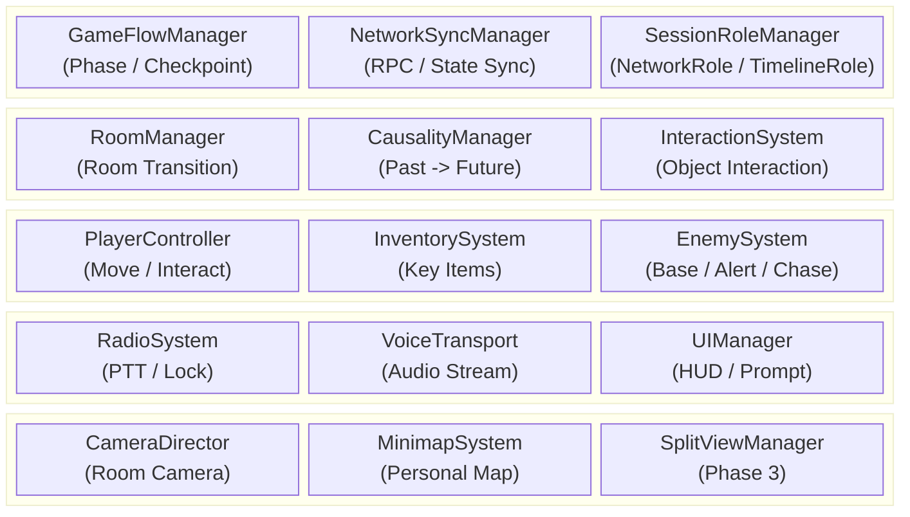

### 2.2 시스템 간 의존성

| 발신 시스템 | 수신 시스템 | 데이터 / 이벤트 | 목적 |
| :--- | :--- | :--- | :--- |
| PlayerController | InteractionSystem | `InteractionRequest` | 오브젝트 조사, 사용, 아이템 적용 요청 |
| InteractionSystem | CausalityManager | `CausalTriggerRequest` | 과거 트리거 활성화 요청 |
| CausalityManager | NetworkSyncManager | `CausalStateChanged` | 미래 월드 상태 변경 동기화 |
| CausalityManager | RoomManager | `ApplyReceiverState` | 미래 리시버 상태 반영 |
| EnemySystem | GameFlowManager | `PlayerCaught` | 공동 실패 및 체크포인트 복귀 |
| EnemySystem | RoomManager | `AlertRoomsRequested` | 현재 방 및 인접 방 경계 상태 전파 |
| RadioSystem | NetworkSyncManager | `RadioLockStateChanged` | 송신권 상태 동기화 |
| VoiceTransport | RadioSystem | `VoiceFrame` | 송신권 보유 중 음성 전송 |
| GameFlowManager | SplitViewManager | `Phase3Started` | Phase 3 스플릿뷰 활성화 |
| RoomManager | MinimapSystem | `RoomVisited` | 개인 방문 기반 미니맵 갱신 |

### 2.3 씬 및 상태 흐름

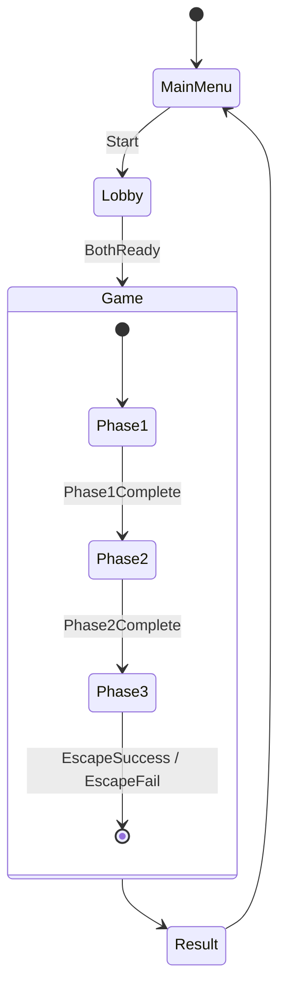

### 2.4 설계 원칙

| 원칙 | 설명 |
| :--- | :--- |
| Host Authority | 게임 진행, 인과, 실패, 경보 판정은 Host가 권위 있게 처리한다. |
| Event-Based Sync | 모든 상태를 매 프레임 동기화하지 않고, 상호작용/인과/경보/체크포인트 이벤트 단위로 전파한다. |
| Data-Driven Rules | 인과 규칙, 적 파라미터, 방 연결, 체크포인트는 데이터로 정의한다. |
| Role Separation | Host/Client와 Past/Future를 분리하여 네트워크 권한과 게임 역할을 혼동하지 않는다. |
| Room-Scoped Pressure | Phase 1~2의 직접 추적은 방 단위로 제한하고, 경보는 인접 방까지 전파한다. |

---

## 3. 세부 설계

> 각 시스템은 Unity 씬 오브젝트에 과도하게 의존하지 않도록 `표현 컴포넌트`, `도메인 서비스`, `데이터 에셋`, `네트워크 경계`를 분리한다.

### 3.0 공통 계층 구조

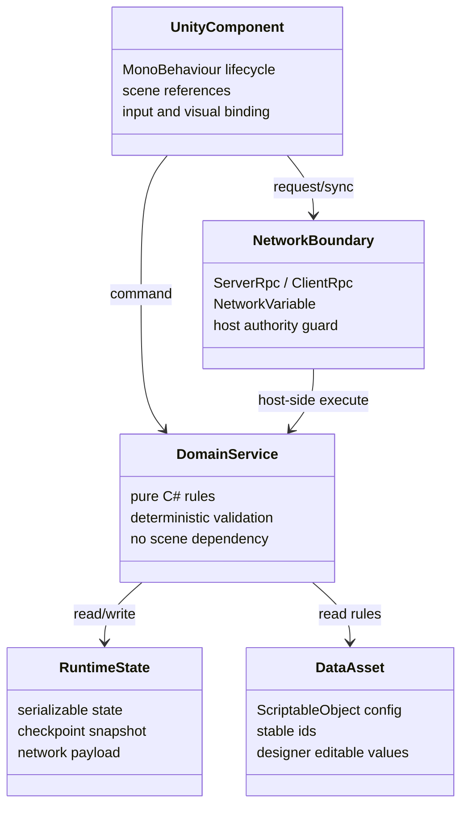

| 계층 | 책임 | 금지 사항 |
| :--- | :--- | :--- |
| Unity Component | 입력, 충돌 콜백, 카메라, UI, 애니메이션 연결 | 핵심 판정 규칙을 직접 보유하지 않는다. |
| Domain Service | 인과 조건, 경보 전파, 체크포인트 복원 등 결정적 규칙 | `GameObject`, `Transform`, 씬 싱글턴에 직접 의존하지 않는다. |
| Data Asset | 규칙과 파라미터 정의 | 런타임 진행 상태를 저장하지 않는다. |
| Runtime State | 현재 방, 역할, 인벤토리, 인과 결과 등 저장 가능한 상태 | 에디터 전용 참조나 씬 인스턴스 참조를 포함하지 않는다. |
| Network Boundary | 권위 판정 위치와 동기화 방향 명시 | Client가 권위 상태를 임의로 확정하지 않는다. |

### 3.1 시간 인과 시스템

**책임**

- Past 플레이어의 트리거 활성화 요청을 검증한다.
- `CausalRuleSO`에 정의된 조건을 평가해 Future 리시버 상태를 변경한다.
- Major/Minor Interaction 완료 상태를 기록하고 GameFlow에 진행 가능 여부를 알린다.
- Host에서 판정하고 양쪽 클라이언트에는 결과 상태만 전파한다.

**구성 요소**

| 요소 | 계층 | 설명 |
| :--- | :--- | :--- |
| `CausalTrigger` | Unity Component | Past 월드의 클릭/사용 대상. Trigger ID와 상호작용 타입을 가진다. |
| `CausalReceiver` | Unity Component | Future 월드의 변경 대상. Receiver ID와 상태 적용 어댑터를 가진다. |
| `CausalityService` | Domain Service | 조건 검증, 규칙 실행, 완료 상태 계산을 담당한다. |
| `CausalityManager` | Unity Component / Network Boundary | Host RPC 진입점과 ClientRpc 결과 적용을 담당한다. |
| `CausalRuleSO` | Data Asset | Trigger, 조건, Receiver 결과, Major/Minor 구분을 정의한다. |
| `CausalityState` | Runtime State | 활성화된 Rule ID, Receiver 상태, 완료한 Major Interaction 목록을 저장한다. |

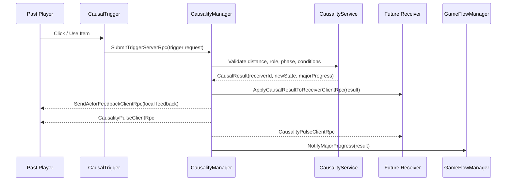

**인터페이스**

| Name | Input | Process | Output | Authority |
| :--- | :--- | :--- | :--- | :--- |
| `SubmitTrigger` | trigger request | 거리, 역할, 페이즈, 필요 아이템 검증 | `CausalResult` 또는 거부 사유 | Host |
| `ApplyReceiverState` | `receiverId`, `stateKey`, `value` | 리시버 어댑터에 상태 적용 | 문 열림, 전원 공급, 장애물 제거 등 | Host 결정, Receiver Owner 표현 |
| `SendActorFeedback` | actor, request result | 요청자에게 로컬 작동 피드백만 제공 | 장치 작동, 조건 불충족 등 | Host 결정, Actor Owner 표현 |
| `PublishCausalityPulse` | causal change event | 실제 인과 변경 발생 시 양쪽 HUD에 추상 Pulse 표시 | 인과 변경 아이콘 점멸/회전/파동 | Host |
| `QueryMajorProgress` | `phaseId` | Major Interaction 완료 여부 계산 | `bool`, 완료 목록 | Host |
| `ResetCausalityToCheckpoint` | `CheckpointState` | 인과 상태를 스냅샷으로 복원 | 복원 이벤트 | Host |

**정보 공개 계약**

- Phase 1~2에서 Future 월드의 구체적 변경 결과는 영향을 받는 시간대 Owner에게만 전송한다.
- Actor에게는 자기 행동이 접수되었거나 로컬 장치가 작동했다는 수준의 피드백만 제공하며, 상대 룸, 리시버 ID, 상태값 등은 노출하지 않는다.
- 실제 `CausalChange`가 발생한 경우 양쪽 HUD의 공통 `CausalityIndicator`가 점멸, 회전, 파동 등으로 인과 변경 발생만 표시한다.
- `CausalityIndicator`는 Major/Minor 여부, Rule ID, Receiver ID, Room ID, 상태값을 표시하지 않는다.
- 거리 부족, 역할 불일치, 아이템 조건 미충족 등은 인과 변경 실패가 아니라 상호작용 요청 거부로 처리하며, 공통 인과 UI는 반응하지 않는다.

**실패/예외**

| 상황 | 처리 |
| :--- | :--- |
| Client가 Future 역할로 Past Trigger 요청 | Host가 거부하고 로컬 프롬프트만 실패 표시 |
| Rule ID 또는 Receiver ID 누락 | 개발 빌드에서는 에러 로그, 릴리스 빌드에서는 요청 무시 |
| 동일 Rule 중복 실행 | `CausalityState`의 실행 기록으로 idempotent 처리 |

**프로토타입 Major Interaction 계약**

| Major ID | 시스템 목적 | 인과 / 정보 계약 | 진행 계약 |
| :--- | :--- | :--- | :--- |
| M1 | 전력 복구 | Past 조작은 Future 전력/장치 상태를 변경하고, Future 관찰 정보는 Past 조작 조건을 결정한다. | 완료 시 `CP-M1` 기준 체크포인트와 Phase 1 진행을 갱신한다. |
| M2 | 보안 정보 접근 | Future의 취약점/상태 정보가 Past 보안 조작 조건을 결정한다. | 완료 시 보안 경로 또는 카드키 관련 진행 상태를 갱신한다. |
| M3 | 청사진 식별 | Past의 후보 정보와 Future의 실험 결과 정보가 함께 올바른 청사진 판정에 필요하다. | 완료 시 Phase 2 진행 상태를 갱신한다. |
| M4 | 실린더 회수 | Past 설정/타이머 조작이 Future 저장소/실린더 상태를 변경한다. | 완료 시 Phase 3 진입 조건을 충족한다. |

### 3.2 네트워크 동기화 시스템

**책임**

- 2인 Host-Client 세션 생성, 참가, 준비 상태, 역할 배정을 관리한다.
- Host Authority가 필요한 게임 판정과 Client 로컬 표현을 분리한다.
- 상태 동기화는 이벤트 기반으로 처리하고, 지속 값은 필요한 경우에만 `NetworkVariable`로 유지한다.
- Phase 1~2의 정보 격리를 보장하기 위해 상대 상태의 복제 범위를 제한한다.

**구성 요소**

| 요소 | 계층 | 설명 |
| :--- | :--- | :--- |
| `NetworkSessionController` | Network Boundary | Host/Join, Timeout, 연결 종료 처리 |
| `SessionRoleManager` | Domain Service / Runtime State | NetworkRole과 TimelineRole 매핑 |
| `NetworkSyncManager` | Network Boundary | 공통 RPC 래퍼, 이벤트 순서 번호, 재전송 대상 관리 |
| `ReplicatedStateRegistry` | Runtime State | 동기화 가능한 상태 ID와 최신 버전 관리 |

**동기화 정책**

| 데이터 | 방식 | 방향 | 빈도 | 근거 |
| :--- | :--- | :--- | :--- | :--- |
| 플레이어 위치 | NetworkTransform 또는 압축 위치 이벤트 | Owner → Host, Phase별 허용 대상 | 고빈도 | 3 페이즈 분할 화면에 필요 |
| 인과 결과 | ClientRpc 이벤트 | Host → Phase별 허용 대상 | 발생 시 | 1프레임 이내 결과 전파 요구 |
| Phase/Checkpoint | NetworkVariable + ClientRpc | Host → All | 변경 시 | 재접속/복구 기준 상태 |
| 무전기 송신권 | NetworkVariable | Host → All | 변경 시 | half-duplex 충돌 방지 |
| 방 방문 기록 | Client 로컬 + Host 검증 이벤트 | Host → Owner | 변경 시 | 정보 격리 유지 |
| AI 경보 상태 | ClientRpc 이벤트 + 상태 버전 | Host → Affected Clients | 변경 시 | 현재/인접 방에만 영향 |

**Phase별 공개 범위**

| 상태 / 데이터 | Phase 1~2 공개 범위 | Phase 3 공개 범위 | 근거 |
| :--- | :--- | :--- | :--- |
| 플레이어 위치 / 상태 | Host와 Owner만 보유한다. 상대 Client에는 복제하지 않는다. | `Phase3Ready`가 양쪽에서 보고되고 Host가 `Phase3Started`를 발행한 뒤, 스플릿뷰 렌더링에 필요한 최소 상태만 양쪽에 복제한다. | 정보 격리 / 스플릿뷰 |
| 현재 룸 | Host와 Owner만 보유한다. | 필요 시 보조 뷰 렌더링 범위로 제한해 복제한다. | 상대 위치 추론 방지 |
| 방문 룸 / 미니맵 | Owner에게만 전송한다. | 원칙적으로 Owner 전용으로 유지한다. | 개인 미니맵 |
| 인벤토리 | Host와 Owner만 보유한다. | 원칙적으로 Owner 전용으로 유지한다. | 개인 인벤토리 |
| 인과 결과 상세 | 영향을 받는 시간대 Owner에게만 전송한다. Actor에게는 로컬 피드백만 제공한다. | 스플릿뷰 렌더링에 필요한 인과/장애물 상태만 양쪽에 허용한다. | 인과 체감 / 정보 격리 |
| 인과 Pulse UI | 양쪽에 전송하되 구체 상태 정보는 포함하지 않는다. | 양쪽에 전송하되 구체 상태 정보는 포함하지 않는다. | 공통 추상 피드백 |
| 경보 상태 | 영향을 받는 룸 또는 Owner 중심으로 전송한다. | 탈출 시퀀스 표현에 필요한 범위로 전송한다. | 압박 표현 |
| Phase / Checkpoint | 양쪽에 전송한다. | 양쪽에 전송한다. | 공동 진행 |
| 무전기 송신권 | 양쪽에 전송한다. | 양쪽에 전송한다. | half-duplex 규칙 |

**인터페이스**

| Name | Input | Process | Output | Authority |
| :--- | :--- | :--- | :--- | :--- |
| `CreateSession` | host player profile | 세션 초기화, Host 역할 등록 | lobby state | Host |
| `JoinSession` | join code / address | Client 연결, 10초 timeout 감시 | connected / rejected | Host |
| `AssignTimelineRoles` | player ids | Past/Future 고정 배정 | role map | Host |
| `PublishGameEvent` | event type, payload, sequence | 순서 검증 후 대상 전파 | acknowledged event | Host |
| `HandleDisconnect` | client id | 일시 정지, 재접속 창 또는 세션 종료 | recovery state | Host |

**동작 흐름**

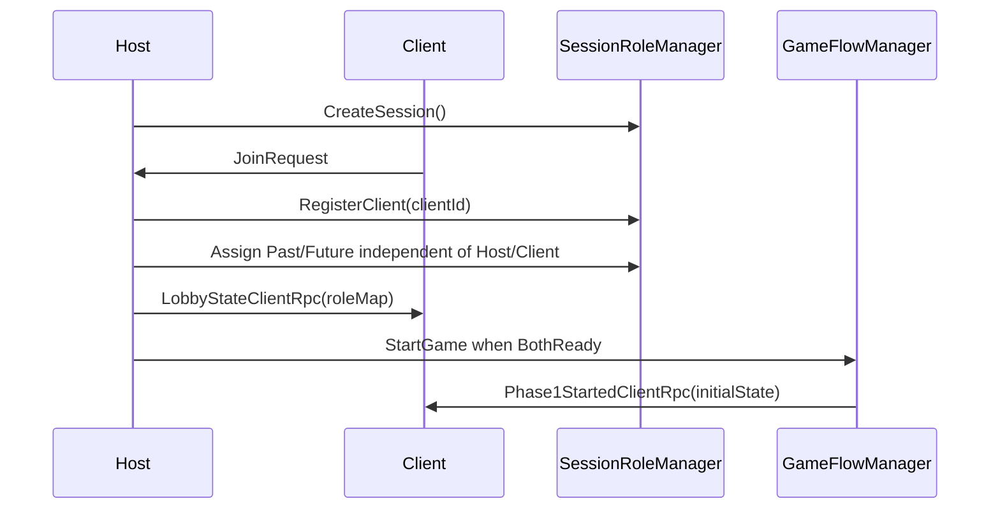

### 3.3 플레이어 제어 및 상호작용 시스템

**책임**

- 2D 이동, 점프, 웅크리기, 플레이어 주변 대상 기준의 조사/획득/아이템 사용, E키 조작물 상호작용을 처리한다.
- Tab 키로 일반 모드와 전투 모드를 전환한다.
- 플레이어 입력을 `InteractionRequest`로 정규화하고, 실제 판정은 Host 또는 도메인 서비스로 전달한다.

**구성 요소**

| 요소 | 계층 | 설명 |
| :--- | :--- | :--- |
| `PlayerInputReader` | Unity Component | Input System 액션을 명령으로 변환 |
| `PlayerMotor2D` | Unity Component | Rigidbody2D 이동, 점프, 웅크리기 적용 |
| `InteractionProbe` | Unity Component | 플레이어 반경 안의 상호작용 후보 탐색, 범위 내 glow, 범위 내 hover 판정 |
| `InteractionService` | Domain Service | 조사, 아이템 사용, 조작물 상호작용 규칙 판정 |
| `InteractableObject` | Unity Component | 조사 텍스트, 필요 아이템, 조작 가능 여부 제공 |

**입력 모드**

| 모드 | 입력 | 대상 | 결과 |
| :--- | :--- | :--- | :--- |
| 일반 | 좌클릭 | 반경 1 unit 안에 있고 마우스를 올린 획득/조사 가능 오브젝트 | 획득 가능하면 `Acquire`, 아니면 `Examine` |
| 일반 | 우클릭 | 반경 1 unit 안에 있고 마우스를 올린 아이템 요구 오브젝트 | 선택 아이템 검증 후 사용, 필요 시 조작 실행 |
| 일반 | E키 | 반경 1 unit 내 문/레버/엘리베이터/계단 등 | `Operate` 실행 |
| 전투 | 좌클릭 | 전투 대상 | 공격 입력 |
| 전투 | 우클릭 | 조준 방향/대상 | 조준 입력 |

반경 안의 모든 상호작용 가능 오브젝트에는 glow 등 강조 효과를 적용한다. 마우스 hover 판정은 반경 안에 있는 오브젝트에 대해서만 유효하다. 범위 밖 오브젝트는 마우스를 올려도 프롬프트와 입력 후보가 되지 않는다.

**인터페이스**

| Name | Input | Process | Output | Authority |
| :--- | :--- | :--- | :--- | :--- |
| `Move` | input vector | 속도 제한, 지면 상태 반영 | Rigidbody2D velocity | Owner Client, Host reconciliation |
| `Jump` | button down | 지면 판정과 점프 높이 적용 | jump impulse | Owner Client |
| `BuildInteractionRequest` | pointer target, selected item, actor state | 조사/사용/E키 모드 판별 | `InteractionRequest` | Owner Client |
| `ValidateInteraction` | request | 거리 1 unit, 역할, 아이템, 대상 상태 검증 | accepted / rejected | Host |

**테스트 기준**

- `InteractionService`는 씬 없이 거리, 역할, 아이템 조건을 단위 테스트할 수 있어야 한다.
- `PlayerMotor2D`는 Unity PlayMode 테스트에서 속도, 점프 높이, Collider 크기를 확인한다.

### 3.4 룸 / 카메라 / 미니맵 시스템

**책임**

- 방 단위 전환, 현재 방 기록, 인접 방 조회, 룸 단위 활성화/비활성화를 관리한다.
- Phase 1~2의 개인 카메라와 개인 미니맵을 유지한다.
- 경보 전파와 체크포인트 복원에 필요한 룸 그래프를 제공한다.

**구성 요소**

| 요소 | 계층 | 설명 |
| :--- | :--- | :--- |
| `RoomVolume` | Unity Component | 룸 진입/이탈 Trigger Collider |
| `RoomGraphSO` | Data Asset | 룸 ID, 인접 룸, 시간대별 대응 룸 정의 |
| `RoomService` | Domain Service | 현재 룸, 방문 룸, 인접 룸 계산 |
| `RoomManager` | Unity Component | 룸 활성화, 전환 이벤트, 스폰 위치 제공 |
| `CameraDirector` | Unity Component | 현재 룸 기준 카메라 구역 전환 |
| `MinimapSystem` | Unity Component | 플레이어별 방문 룸만 표시 |

**인터페이스**

| Name | Input | Process | Output | Authority |
| :--- | :--- | :--- | :--- | :--- |
| `EnterRoom` | player id, room id | 현재 룸 갱신, 방문 기록 추가 | `RoomChanged`, `RoomVisited` | Host 기록, Owner 표시 |
| `GetAdjacentRooms` | room id | 룸 그래프 조회 | room id list | Pure |
| `ActivateRoomSet` | current room, adjacent rooms | 렌더러/AI/오브젝트 활성 범위 조정 | activation plan | Client local |
| `ResolveSpawnPoint` | checkpoint id, timeline role | 사전 정의 스폰 조회 | spawn transform id | Host |

**동작 흐름**

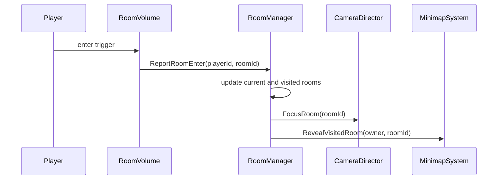

### 3.5 AI / 경보 시스템

**책임**

- 적의 기본/경계/추적 상태를 관리한다.
- 플레이어 감지, 은신 회피, 추적 해제 지연을 판정한다.
- 발각 시 현재 방과 인접 방에 경보를 전파하고, 포획 시 공동 실패를 발생시킨다.

**상태 전이**

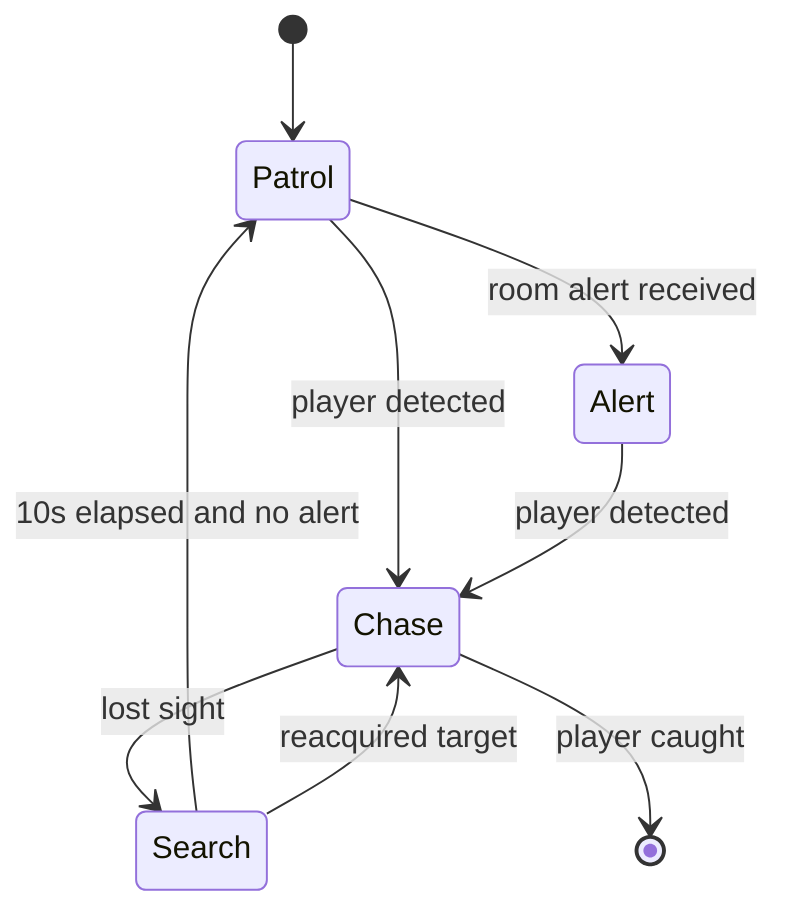

**구성 요소**

| 요소 | 계층 | 설명 |
| :--- | :--- | :--- |
| `EnemyController` | Unity Component | Nav/이동/애니메이션 연결 |
| `EnemyPerception2D` | Unity Component | 10 unit, 45도 시야와 장애물 Raycast |
| `EnemyStateMachine` | Domain Service | Patrol/Alert/Chase/Search 전이 판정 |
| `AlertService` | Domain Service | 현재 방과 인접 방 경보 대상 계산 |
| `EnemyTuningSO` | Data Asset | 감지 거리, FOV, 추적 속도, 해제 지연 |
| `AlertState` | Runtime State | 방별 경보 상태와 만료 시간 |

**인터페이스**

| Name | Input | Process | Output | Authority |
| :--- | :--- | :--- | :--- | :--- |
| `EvaluateSight` | enemy pose, player pose, crouch/hidden state | FOV, 거리, 차폐 검사 | detected / not detected | Host |
| `RaiseAlert` | source room id | 현재 방과 인접 방 계산 | `AlertRoomsChanged` | Host |
| `TickEnemyState` | enemy state, perception, time | 상태 전이와 목표 선택 | new enemy state | Host |
| `ReportPlayerCaught` | enemy id, player id | 공동 실패 요청 | checkpoint rollback | Host |

**경보 전파 흐름**

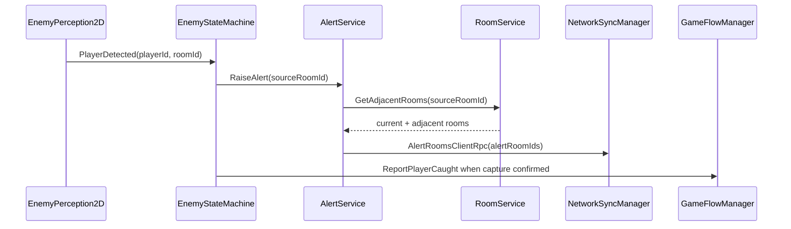

**설계 메모**

- 룸 전환을 넘어 직접 추적하지 않는 규칙은 `EnemyStateMachine`이 아닌 `RoomService`와의 계약으로 둔다.
- AI 이동 구현은 프로토타입에서 단순 waypoint와 line-of-sight를 우선하고, NavMesh 계열 도입은 TBD로 남긴다.

### 3.6 무전기 통신 시스템

**책임**

- Push-to-Talk 입력과 half-duplex 송신권을 관리한다.
- 한 명만 송신할 수 있도록 Host가 송신권을 부여/회수한다.
- 음성 스트림과 통신 상태 UI를 분리한다.

**구성 요소**

| 요소 | 계층 | 설명 |
| :--- | :--- | :--- |
| `RadioInputController` | Unity Component | PTT 키 입력 감지 |
| `RadioService` | Domain Service | 송신권 요청, 충돌, timeout 규칙 |
| `RadioNetworkBridge` | Network Boundary | 송신권 RPC, 상태 동기화 |
| `VoiceTransport` | Infrastructure | 실제 음성 프레임 송수신 |
| `RadioHudPresenter` | Unity Component | 송신/수신/점유 상태 표시 |

**동작 흐름**

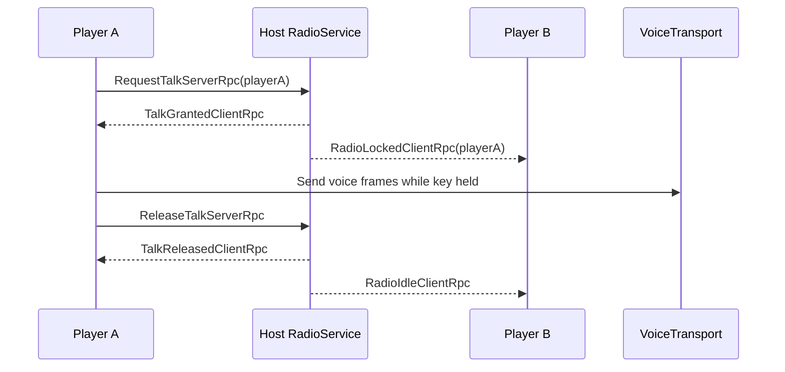

**인터페이스**

| Name | Input | Process | Output | Authority |
| :--- | :--- | :--- | :--- | :--- |
| `RequestTalk` | player id | 송신권 공석 여부 확인 | granted / denied | Host |
| `ReleaseTalk` | player id | 현재 소유자 확인 후 해제 | idle state | Host |
| `TransmitVoiceFrame` | encoded audio frame | 송신권 보유자만 전달 | remote audio playback | Current talker |
| `UpdateRadioHud` | radio state | 아이콘/게이지/점유자 표시 | UI state | Client local |

### 3.7 인벤토리 시스템

**책임**

- 플레이어별 개인 가방과 키 아이템 상태를 관리한다.
- 직접 아이템 공유를 금지하고, 아이템 사용은 대상 오브젝트와의 상호작용으로만 발생한다.
- 체크포인트 복원을 위해 소지/소모 상태를 직렬화한다.

**구성 요소**

| 요소 | 계층 | 설명 |
| :--- | :--- | :--- |
| `InventoryService` | Domain Service | 획득, 선택, 사용, 소모 규칙 |
| `InventoryController` | Unity Component | 아이템 줍기 콜백과 UI 연결 |
| `ItemDefinitionSO` | Data Asset | 아이템 ID, 표시명, 사용 가능 태그 |
| `InventoryState` | Runtime State | 플레이어별 아이템 목록, 선택 아이템 |

**인터페이스**

| Name | Input | Process | Output | Authority |
| :--- | :--- | :--- | :--- | :--- |
| `AcquireItem` | player id, item id | 중복/소지 제한 확인 | inventory changed | Host |
| `SelectItem` | player id, item id | 소지 여부 확인 | selected item changed | Owner Client |
| `UseItemOnTarget` | player id, item id, target id | 대상 태그와 필요 조건 검증 | interaction request | Host |
| `RestoreInventory` | checkpoint inventory state | 소지품 복원 | inventory changed | Host |

### 3.8 Phase 3 스플릿뷰 시스템

**책임**

- Phase 3에서 상하 5:5 스플릿뷰를 활성화한다.
- 상대 화면 영상을 네트워크로 송수신하지 않고, 양쪽 시간대 화면을 각 클라이언트가 로컬에서 렌더링한다.
- 각 클라이언트는 자기 캐릭터를 추적하는 메인 카메라 제어권을 유지하고, 상대 시간대는 읽기 전용 보조 뷰로 렌더링한다.
- 양쪽 시간대 화면을 같은 UI에 표시하되, 입력은 자기 캐릭터에만 적용한다.
- Phase 1~2의 정보 격리 규칙에 대한 예외를 명시적으로 GameFlow에서만 열 수 있게 한다.
- 상대 상태 복제는 Phase 3 전환 요청 직후가 아니라 양쪽 클라이언트가 준비 완료를 보고한 뒤 Host가 시작 이벤트를 발행하는 시점에만 허용한다.

**기술 설명**

Phase 3 스플릿뷰는 영상 스트리밍 기능이 아니다. 각 클라이언트는 Phase 3에 필요한 Past/Future 탈출 경로, 플레이어 아바타, 장애물, 인과 상태를 로컬에 로드하고, 네트워크로 수신한 상태 데이터만 사용해 자기 화면을 구성한다. 즉 네트워크는 픽셀 프레임을 전송하지 않고, 위치/상태/이벤트만 동기화한다.

스플릿뷰 렌더링은 `메인 카메라 + 읽기 전용 보조 뷰` 구조를 사용한다. 자기 시간대는 기존 메인 카메라가 계속 추적하고, 상대 시간대는 보조 카메라가 `RenderTexture`에 렌더링한 뒤 UI 영역에 표시한다. 보조 뷰는 Presentation 전용 출력이며 입력 권한, 카메라 흔들림, 줌, 타겟 전환 같은 게임 카메라 제어권을 갖지 않는다.

| 구분 | 방식 | 네트워크 부하 |
| :--- | :--- | :--- |
| 잘못된 접근 | 상대 카메라 영상을 캡처해 실시간 송출/수신 | 매우 큼. 해상도와 FPS에 비례 |
| 채택 접근 | 자기 메인 카메라를 유지하고, 상대 시간대는 상태 데이터 기반 RenderTexture 보조 뷰로 로컬 렌더링 | 작음. 위치, 상태, 이벤트만 전송 |

Phase 3 전환 시 각 클라이언트는 탈출 경로, 카메라, 보조 뷰 준비를 마친 뒤 준비 완료를 Host에 보고한다. `GameFlowManager`는 양쪽 준비가 확인된 뒤 `Phase3Started` 이벤트를 발행한다. 각 클라이언트의 `SplitViewManager`는 이 이벤트를 받아 자기 시간대 메인 카메라의 UI 표시 영역을 조정하고, 상대 시간대 보조 카메라를 활성화해 `RenderTexture`에 출력한다. UI는 메인 카메라 출력과 보조 뷰 출력을 상하 5:5 영역에 배치한다.

| 출력 | 렌더링 대상 | 표시 방식 | 제어권 |
| :--- | :--- | :--- | :--- |
| 자기 시간대 메인 뷰 | 로컬 플레이어의 시간대 경로, 자기 캐릭터, 해당 시간대 오브젝트 | 기존 메인 카메라 출력을 스플릿뷰 UI 영역에 배치 | 로컬 플레이어 카메라 제어권 보유 |
| 상대 시간대 보조 뷰 | 상대 시간대 경로, 상대 캐릭터, 상대 시간대 오브젝트 | 보조 카메라가 `RenderTexture`로 렌더링 후 UI에 표시 | 읽기 전용. 입력/게임 카메라 제어권 없음 |

**동기화 데이터**

| 데이터 | 동기화 방식 | 설명 |
| :--- | :--- | :--- |
| 플레이어 위치/상태 | `NetworkTransform` 또는 상태 이벤트 | 상대 플레이어 아바타를 로컬에서 표시하기 위한 최소 상태 |
| Phase 3 준비/시작/종료 | Client 준비 보고 + Host 권위 상태 이벤트 | 양쪽 클라이언트가 같은 진행 상태에서 스플릿뷰와 상대 최소 상태 복제를 활성화 |
| 장애물/인과 상태 | 이벤트 기반 RPC | 과거 행동으로 미래 경로가 열리거나 막히는 결과 반영 |
| 실패/성공 판정 | Host 권위 이벤트 | 한쪽 실패 시 공동 실패 처리 |
| 카메라 영상 | 동기화하지 않음 | 각 클라이언트가 로컬에서 직접 렌더링 |

**입력 소유권**

스플릿뷰에서는 양쪽 시간대가 모두 보이지만, 입력 시스템은 로컬 플레이어가 소유한 `PlayerController`에만 입력 이벤트를 전달한다. 상대 플레이어 캐릭터는 네트워크 상태를 따라 움직이는 원격 아바타로 보조 뷰에 렌더링되며, 로컬 입력을 받지 않는다. 따라서 화면에 두 캐릭터가 보이더라도 조작 권한은 기존 Past/Future 역할 고정 규칙을 따른다.

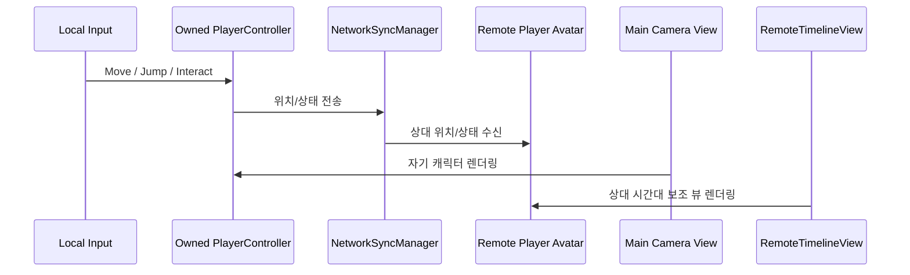

**구성 요소**

| 요소 | 계층 | 설명 |
| :--- | :--- | :--- |
| `SplitViewManager` | Unity Component | 카메라 rect, viewport, UI anchor 변경 |
| `TimelineCameraRig` | Unity Component | 자기 시간대 메인 카메라 추적 대상 |
| `RemoteTimelineView` | Unity Component | 상대 시간대 보조 카메라와 RenderTexture 출력 관리 |
| `SplitViewState` | Runtime State | 활성 여부, 분할 방향, 각 카메라 대상 |
| `PhasePresentationSO` | Data Asset | Phase별 카메라/연출 설정 |

**인터페이스**

| Name | Input | Process | Output | Authority |
| :--- | :--- | :--- | :--- | :--- |
| `EnableSplitView` | phase id, local target, remote target | 메인 뷰 UI 영역 조정, 상대 보조 뷰 RenderTexture 활성화 | split active | Host event, Client local render |
| `DisableSplitView` | reason | 보조 뷰 비활성화, 메인 카메라 단일 화면 복귀 | split inactive | Host event |
| `RouteInputToOwner` | input action, local player id | 로컬 소유 캐릭터만 조작 | player command | Owner Client |

**리스크**

- DRD의 "0프레임 딜레이"는 네트워크 물리 동기화의 문자 그대로의 보장이 아니라 같은 Host tick 결과를 같은 프레임에 렌더링하는 목표로 해석한다. 구현 검증 시 동일 이벤트의 표시 프레임 차이를 측정한다.

### 3.9 게임 진행 / 체크포인트 시스템

**책임**

- Phase 전환, Major Interaction 완료 판정, 공동 실패, 체크포인트 저장/복귀를 관리한다.
- 실패와 연결 끊김 이후 복원 가능한 최소 상태를 정의한다.

**구성 요소**

| 요소 | 계층 | 설명 |
| :--- | :--- | :--- |
| `GameFlowManager` | Network Boundary / Unity Component | 게임 상태 전이와 RPC 전파 |
| `PhaseService` | Domain Service | Phase 완료 조건과 다음 Phase 계산 |
| `CheckpointService` | Domain Service | 스냅샷 생성/복원 |
| `CheckpointDefinitionSO` | Data Asset | 체크포인트 ID, 스폰, 초기 룸, 복원 정책 |
| `GameSessionState` | Runtime State | 현재 Phase, 체크포인트, 공동 실패 상태 |
| `CheckpointSnapshot` | Runtime State | 플레이어, 인벤토리, 인과, 룸, AI 상태 스냅샷 |

**상태 흐름**

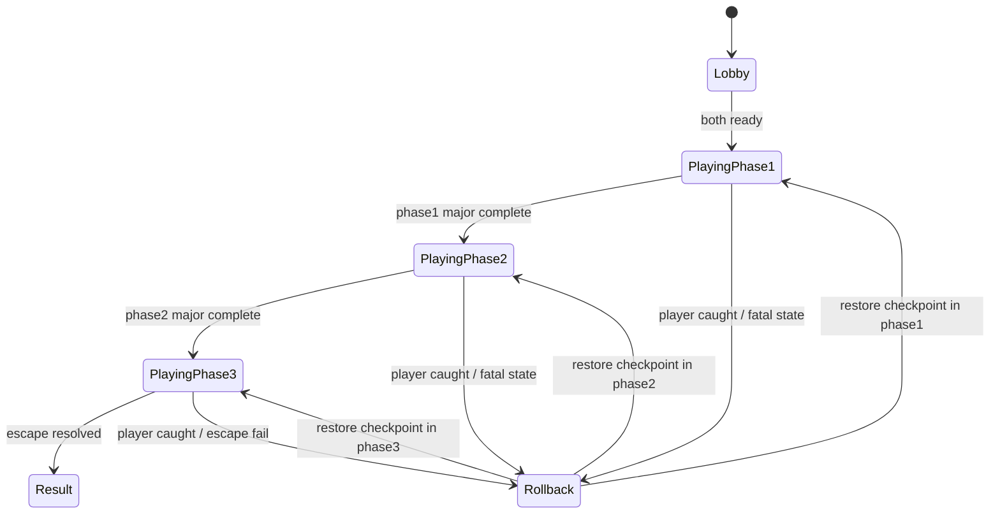

**체크포인트 복귀 흐름**

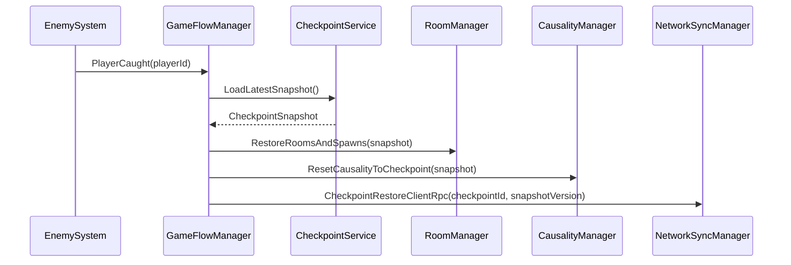

**인터페이스**

| Name | Input | Process | Output | Authority |
| :--- | :--- | :--- | :--- | :--- |
| `NotifyMajorComplete` | phase id, major id | 완료 목록 갱신, Phase 완료 조건 검사 | phase progress | Host |
| `CreateCheckpoint` | checkpoint id | 현재 RuntimeState 스냅샷 생성 | `CheckpointSnapshot` | Host |
| `RollbackToCheckpoint` | failure reason | 플레이어/룸/인과/AI/인벤토리 복원 | restored state | Host |
| `TransitionPhase` | target phase | 데이터 로드, 카메라/UI/스플릿뷰 이벤트 발행 | phase started | Host |
| `HandleSessionTimeout` | disconnected client id | 일시 정지 또는 종료 정책 적용 | recovery UI | Host |

### 3.10 UI / HUD 시스템

**책임**

- 정보 격리 규칙을 UI에도 적용한다.
- 상호작용 프롬프트, 무전기 상태, 인벤토리, 개인 미니맵, 단기 목표를 표시한다.
- 실제 인과 변경 발생 시 양쪽 플레이어에게 공통 `CausalityIndicator`를 추상 피드백으로 표시한다.
- Phase 진행 상태는 내부 진행 관리 정보로만 사용하며 UI에 직접 표시하지 않는다.
- UI는 권위 판정을 하지 않고 로컬 표시와 입력 보조만 담당한다.

**구성 요소**

| 요소 | 계층 | 설명 |
| :--- | :--- | :--- |
| `HudPresenter` | Unity Component | HUD 상태를 ViewModel로 렌더링 |
| `InteractionPromptPresenter` | Unity Component | 근접/E키/클릭 프롬프트 표시 |
| `InventoryPresenter` | Unity Component | 개인 인벤토리 HUD 5슬롯, 선택 아이템, 상세 팝업 표시 |
| `MinimapPresenter` | Unity Component | 방문한 개인 룸만 표시 |
| `ObjectivePresenter` | Unity Component | 현재 단기 목표와 체크포인트 알림 표시 |
| `CausalityIndicatorPresenter` | Unity Component | 인과 변경 발생을 점멸/회전/파동 등 추상 UI로 표시 |
| `HudViewModelBuilder` | Domain Service | RuntimeState를 표시 가능한 ViewModel로 변환 |

**인터페이스**

| Name | Input | Process | Output | Authority |
| :--- | :--- | :--- | :--- | :--- |
| `BuildHudViewModel` | local player state, allowed replicated state | 정보 격리 필터 적용 | HUD view model | Client local |
| `ShowInteractionPrompt` | nearby interactable, selected item | 가능한 행동 라벨 결정 | prompt state | Client local |
| `ShowCausalityPulse` | pulse event | 구체 상태 정보 없이 공통 인과 아이콘 애니메이션 표시 | pulse animation | Client local |

`InventoryPresenter`는 현재 `InventoryService.MAX_SLOT_COUNT` 기준으로 실제 HUD 슬롯 5개를 표시한다. `I` 키 팝업은 상세 정보 패널과 함께 5개 실제 슬롯, 10개 예비 슬롯 영역을 보여주며, 예비 슬롯은 인벤토리 도메인 모델이 확장되기 전까지 비활성 표시로 유지한다.
| `ShowCheckpointNotice` | checkpoint event | 알림 표시 | toast / banner | Client local |
| `ShowConnectionWarning` | timeout/reconnect state | 네트워크 상태 표시 | warning modal | Client local |

---

## 4. 데이터 설계

### 4.1 데이터 분류

| 분류 | 저장 위치 | 예시 | 설계 기준 |
| :--- | :--- | :--- | :--- |
| 정적 규칙 데이터 | ScriptableObject | 인과 규칙, 룸 그래프, 적 파라미터, 아이템 정의 | 에디터에서 검수 가능하고 Git diff가 가능한 작은 단위로 분리 |
| 런타임 상태 | Serializable C# struct/class | 현재 Phase, 인과 완료, 인벤토리, AI 상태 | 체크포인트와 네트워크 payload로 재사용 가능 |
| 네트워크 메시지 | RPC payload / NetworkVariable | 상호작용 요청, 인과 결과, 경보, 송신권 | stable ID 기반, 씬 참조 금지 |
| 체크포인트 데이터 | Runtime snapshot | 플레이어 위치, 룸, 아이템, 인과, AI | 실패 복구 시 동일 결과 재현 |

### 4.2 ScriptableObject 스키마

| SO | 주요 필드 | 사용 시스템 |
| :--- | :--- | :--- |
| `CausalRuleSO` | `ruleId`, `triggerId`, `requiredRole`, `requiredItemId`, `conditions`, `receiverEffects`, `interactionWeight` | 시간 인과 |
| `RoomGraphSO` | `roomId`, `timeline`, `adjacentRoomIds`, `pairedTimelineRoomId`, `spawnPointIds` | 룸, AI, 체크포인트 |
| `EnemyTuningSO` | `enemyType`, `sightDistance`, `fovDegrees`, `chaseSpeed`, `loseSightSeconds`, `alertDuration` | AI / 경보 |
| `ItemDefinitionSO` | `itemId`, `displayName`, `description`, `icon`, `category`, `usableTargetTags`, `consumeOnUse` | 인벤토리 / 상호작용 |
| `CheckpointDefinitionSO` | `checkpointId`, `phaseId`, `pastSpawnId`, `futureSpawnId`, `restorePolicy` | 게임 진행 |
| `PhaseDefinitionSO` | `phaseId`, `requiredMajorIds`, `presentationMode`, `checkpointIds` | 게임 진행 / 스플릿뷰 |

### 4.3 런타임 상태 스키마

| 상태 | 필드 | 설명 |
| :--- | :--- | :--- |
| `PlayerRuntimeState` | `playerId`, `timelineRole`, `currentRoomId`, `position`, `isCrouching`, `isCaught` | 플레이어 복원과 UI 표시 기준 |
| `InventoryState` | `playerId`, `ownedItemIds`, `selectedItemId`, `consumedItemIds` | 개인 가방 상태 |
| `CausalityState` | `appliedRuleIds`, `receiverStates`, `completedMajorIds` | 인과 결과와 진행 조건 |
| `RoomVisitState` | `playerId`, `visitedRoomIds`, `currentRoomId` | 개인 미니맵과 체크포인트 |
| `AlertState` | `roomId`, `alertLevel`, `expiresAtTick` | 경보 전파와 AI 상태 |
| `GameSessionState` | `phaseId`, `checkpointId`, `sessionStatus`, `roleMap` | 세션 복구 기준 |

### 4.4 네트워크 메시지

네트워크 메시지는 구현 필드명을 고정하지 않고, 메시지별 목적, 공개 범위, 포함 가능한 정보 범주와 금지 정보를 계약으로 정의한다. 실제 C# payload 타입과 필드명은 구현 단계에서 정하되, 아래 계약을 위반하지 않아야 한다.

| 메시지 | 목적 | 방향 | 포함 정보 범주 | 포함 금지 정보 | 권위 / 검증 | 공개 범위 |
| :--- | :--- | :--- | :--- | :--- | :--- | :--- |
| `InteractionRequestServerRpc` | 플레이어가 대상 상호작용 의도를 Host에 요청 | Owner → Host | 대상 식별자, 상호작용 모드, 선택 아이템 참조, 요청 순서 | actor 확정값, timeline role 확정값, 위치/거리 판정값, 현재 룸 확정값 | Host가 송신자 기준으로 역할, 위치, 거리, 아이템, 대상 상태를 검증 | Host only |
| `CausalResultToReceiverClientRpc` | 승인된 인과 변경을 영향을 받는 시간대에 적용 | Host → Receiver Owner | 변경 대상 식별자, 변경 상태 범주, 적용 순서/시점 | 상대 플레이어 위치, 상대 룸 기록, 불필요한 Actor 정보 | Host 결정 결과만 적용 | Phase 1~2는 Receiver Owner 중심, Phase 3는 스플릿뷰 필요 범위 허용 |
| `CausalFeedbackToActorClientRpc` | 요청자에게 자기 행동의 접수/작동 피드백 제공 | Host → Actor Owner | 로컬 피드백 종류, 요청 처리 결과, 표시 순서/시점 | Future의 구체 룸, 리시버 ID, 상태값, Major/Minor 여부 | Host 검증 결과 | Actor Owner only |
| `CausalityPulseClientRpc` | 양쪽 HUD에 인과 변경 발생을 추상 표시 | Host → All | 표시 순서, 표시 시점, Pulse 종류 | Rule ID, Receiver ID, Room ID, 상태 키/값, Major/Minor 여부 | 실제 `CausalChange` 발생 시에만 발행 | All |
| `RoomChangedClientRpc` | 개인 룸 상태와 방문 기록 갱신 | Host → Owner | 소유 플레이어의 현재 룸, 방문 룸 범주, 표시 순서 | 상대 플레이어의 룸, 상대 방문 기록, 상대 위치 | Host가 RoomVolume 진입과 룸 그래프 기준으로 확정 | Owner only |
| `AlertRoomsClientRpc` | 경보 상태를 영향 범위에 전파 | Host → Affected Clients | 경보 대상 룸 범주, 경보 수준, 만료 기준 | 영향 범위 밖 룸 상태, 상대 위치/방문 기록 | Host가 감지와 인접 룸 규칙 기준으로 확정 | Affected only |
| `Phase3ReadyServerRpc` | 클라이언트의 Phase 3 렌더링 준비 완료 보고 | Owner → Host | 준비 완료 상태, 로컬 준비 대상 범주 | 상대 상태 요청, 상대 위치/룸 정보 | Host가 양쪽 준비 완료를 집계 | Host only |
| `Phase3StartedClientRpc` | Phase 3 스플릿뷰와 최소 상대 상태 복제 개방 | Host → All | Phase 3 시작 시점, 표시 모드, 복제 개방 범위 | Phase 1~2의 상대 룸 히스토리, 상대 인벤토리, 상대 단서 | Host만 발행 | All |
| `RadioLockNetworkVariable` | half-duplex 송신권 상태 공유 | Host → All | 현재 송신권 상태, 송신자 식별 범주, 갱신 시점 | 음성 내용 메타데이터, 불필요한 위치/룸 정보 | Host만 쓰기 | All |
| `CheckpointRestoreClientRpc` | 공동 실패 후 체크포인트 복원 시작 | Host → All | 체크포인트 식별자, 스냅샷 버전, 복원 시작 시점 | 상대 개인 정보 상세, 불필요한 룸 히스토리 | Host가 최신 스냅샷 기준으로 발행 | All |

### 4.5 ID 규칙

| 대상 | 형식 | 예시 |
| :--- | :--- | :--- |
| Phase | `PHASE_{number}` | `PHASE_01` |
| Room | `{timeline}_{area}_{index}` | `PAST_LAB_A01` |
| Causal Rule | `CR_{phase}_{verb}_{target}` | `CR_P1_POWER_DOOR` |
| Item | `ITEM_{category}_{name}` | `ITEM_KEY_LAB_A` |
| Checkpoint | `CP_{phase}_{index}` | `CP_P2_02` |

ID는 네트워크 payload와 체크포인트 스냅샷에 들어가므로 변경 비용이 크다. 표시명 변경은 별도 localization/display 필드로 처리한다.

---

## 5. 요구사항 추적 매트릭스

### 5.1 기능 요구사항 추적

| DRD ID | 요구사항 | DSD 설계 항목 | 검증 관점 |
| :--- | :--- | :--- | :--- |
| FR-01 | Host-Client 접속 | §3.2 | 2인 세션 생성/참가/시작 |
| FR-02 | Timeout 처리 | §3.2, §3.9 | 10초 무응답 후 상태 전환 |
| FR-03 | 재접속 시도 | §3.2, §3.9 | `GameSessionState` 기준 복구 |
| FR-04 | 정보 격리 | §2.4, §3.2, §3.4, §3.10 | 복제 필터링과 표시 필터링으로 상대 정보 직접 접근 방지 |
| FR-05 | 무전기 통신 | §3.6 | half-duplex 송신권 충돌 방지 |
| FR-06 | 인과 전파 | §3.1, §4.4 | Host 판정 후 Receiver 결과, Actor 피드백, 공통 Pulse 분리 |
| FR-07 | 상호작용 반경 | §3.1, §3.3 | 1 unit 거리 검증 |
| FR-08 | 데이터 드리븐 인과 | §3.1, §4.2 | `CausalRuleSO` 추가로 규칙 확장 |
| FR-09 | 이동/점프 | §3.3 | 속도 5, 점프 높이 2 |
| FR-10 | 2D Collider 충돌 | §3.3 | 1x2 Collider PlayMode 확인 |
| FR-11 | AI 감지/추격 | §3.5 | 10 unit, 45도 FOV 판정 |
| FR-12 | AI 감시 복귀 | §3.5 | 10초 해제 지연 |
| FR-13 | 은신 회피 | §3.5 | crouch/hidden state 감지 필터 |
| FR-14 | Phase 3 분할 화면 | §3.8 | 5:5 viewport 구성 |
| FR-15 | 분할 화면 동기화 | §3.2, §3.8 | 양쪽 `Phase3Ready` 이후 동일 Host tick 결과 표시 |
| FR-16 | 3페이즈 구성 | §2.3, §3.9 | Phase1→2→3 전이 |
| FR-17 | 체크포인트 자동 저장 | §3.9, §4.3 | 실패 후 스냅샷 복원 |

### 5.2 비기능 요구사항 추적

| DRD ID | 요구사항 | DSD 설계 항목 | 검증 관점 |
| :--- | :--- | :--- | :--- |
| NFR-01 | 60 FPS | §2.4, §3.4, §4.1 | 룸 단위 활성화, 이벤트 기반 동기화 |
| NFR-02 | 16:9 최적화 | §3.8, §3.10 | 1920x1080, 1280x720 HUD 검증 |
| NFR-03 | Ping 100ms | §3.2 | RTT 측정과 이벤트 지연 확인 |
| NFR-04 | Timeout 10초 | §3.2, §3.9 | 연결 중단 시 타임아웃 측정 |
| NFR-05 | 크래시율 < 1% | §3.9, §4.3 | 체크포인트 복구와 예외 상태 처리 |

### 5.3 리스크 / TBD

| 항목 | 리스크 | 기본 설계 | 검증 필요 |
| :--- | :--- | :--- | :--- |
| 음성 전송 | Netcode만으로 음성 품질/지연을 보장하기 어려울 수 있음 | `VoiceTransport`를 별도 인프라 경계로 분리 | Unity Vivox, Steam Voice, 외부 라이브러리 비교 |
| Phase 3 동기화 | "0프레임 딜레이"의 구현 가능성 | Host tick 기준 이벤트 표시 동기화 | 실제 2PC에서 표시 프레임 차이 측정 |
| AI 이동 | 2D 사이드뷰에서 NavMesh 적용성이 불확실 | waypoint 기반 추적 우선 | 장애물/층간 이동 프로토타입 |
| 재접속 | 프로토타입 일정에서 완전 재접속 구현이 부담 | `GameSessionState`와 체크포인트 복원 경계 설계 | Must/Should 범위 재확인 |
| ID 관리 | 수동 ID 중복 가능성 | stable ID 규칙과 에디터 검증 도구 예정 | SO ID 중복 검사 구현 |

### 5.4 핵심 설계 계약 검증

| 계약 | 검증 관점 |
| :--- | :--- |
| Phase 1~2 정보 격리 | 상대 위치, 현재 룸, 방문 기록, 아바타 상태, 단서 상태가 비소유 Client에 복제되지 않는지 확인 |
| Phase 3 복제 개방 | 양쪽 `Phase3Ready` 이후 Host의 `Phase3Started` 시점에만 상대 최소 상태가 복제되는지 확인 |
| 인과 결과 상세 | Phase 1~2에서 Future 결과 상세가 Past에게 전달되지 않고, Actor에는 로컬 피드백만 전달되는지 확인 |
| 인과 Pulse UI | 실제 `CausalChange` 발생 시 양쪽 HUD가 Rule/Receiver/Room/상태값 없이 같은 추상 피드백만 표시하는지 확인 |
| Host Authority | 클라이언트가 보낸 역할, 거리, 룸, 상태 주장을 신뢰하지 않고 Host 보유 상태로 검증하는지 확인 |
| 개인 미니맵 / 인벤토리 | 방문 룸과 소지품 정보가 Owner와 Host 범위를 벗어나 노출되지 않는지 확인 |
| 체크포인트 복원 | 공동 실패 후 플레이어, 인과, 룸, AI, 인벤토리 상태가 스냅샷 기준으로 일관되게 복원되는지 확인 |

---

## 6. 참고 자료

1. Unity Technologies. Unity 6 Documentation.
2. Unity Technologies. Netcode for GameObjects Documentation.
