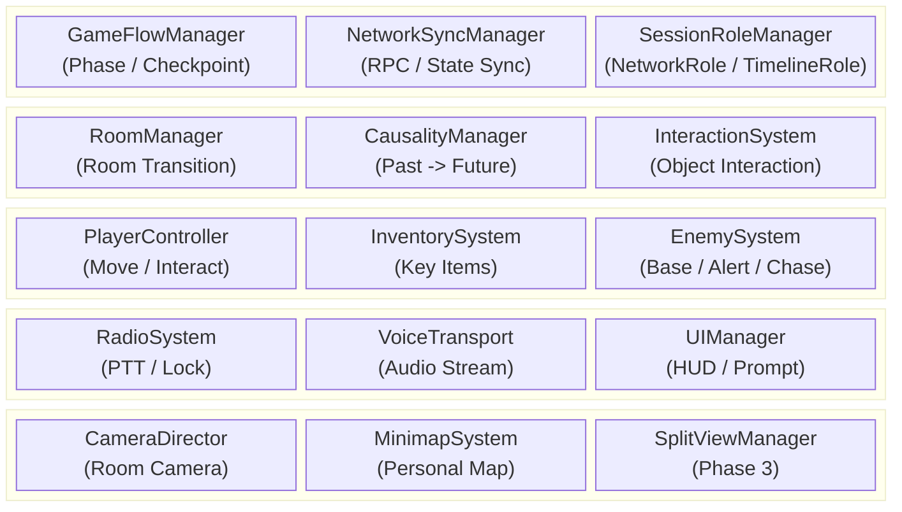
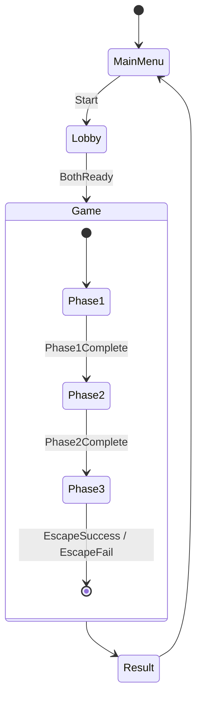
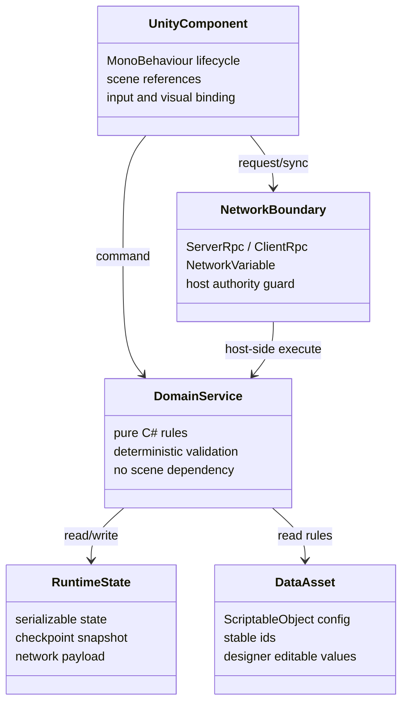
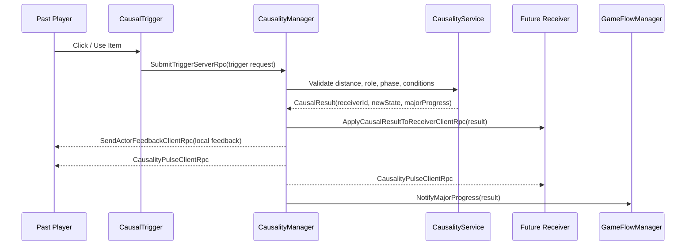

# Caretaker DSD — Part 1: 요약문 / 서론 / 시스템 설계

> 본 파일은 DSD를 팀원별로 분할한 파트입니다. 최종적으로 `DSD.md`에 병합됩니다.

---

# Caretaker — Design Specification Document

| 버전 | 내용 | 작업자 |
| :---: | :--- | :---: |
| 260507 | DSD 초안 구조 정리 | 유민서 |
| 260510 | DSD 작성 | 전원 |
| 260514 | DSD 작성 | 전원 |

> 본 문서는 6월 프로토타입 기준의 소프트웨어 설계 명세서다. 세부 시나리오와 레벨 디자인은 시스템 설계에 필요한 예시 수준으로만 다루며, 핵심 기능의 구조, 모듈, 인터페이스, 데이터, 동기화 흐름을 명세한다.

---

## 개요 / 바로가기

| 구분 | 바로가기 | 목적 |
| :--- | :--- | :--- |
| 문서 요약 | [요약문](#요약문) | 목적, 기술 스택, 제품 요약 확인 |
| 기본 전제 | [1. 서론](#1-서론) | 범위, 용어, 참조 문서, 주요 사양 확인 |
| 전체 구조 | [2. 시스템 설계](#2-시스템-설계) | 전체 아키텍처, 시스템 의존성, 상태 흐름, 설계 원칙 확인 |
| 세부 시스템 | [3. 세부 설계](#3-세부-설계) | 인과, 네트워크, 플레이어, 룸, AI, 무전기, 인벤토리, 스플릿뷰, 체크포인트, UI 설계 확인 |
| 데이터 / 메시지 | [4. 데이터 설계](#4-데이터-설계) | ScriptableObject, Runtime State, 네트워크 메시지 계약, ID 규칙 확인 |
| 요구사항 검증 | [5. 요구사항 추적 매트릭스](#5-요구사항-추적-매트릭스) | DRD 요구사항 매핑, 리스크, 핵심 설계 계약 검증 확인 |
| 참고 자료 | [6. 참고 자료](#6-참고-자료) | 문서 작성에 사용한 외부 기준 확인 |

**핵심 설계 바로가기**

| 항목 | 바로가기 |
| :--- | :--- |
| 시간 인과 시스템 | [3.1 시간 인과 시스템](#31-시간-인과-시스템) |
| 네트워크 공개 범위 | [3.2 네트워크 동기화 시스템](#32-네트워크-동기화-시스템) |
| Phase 3 스플릿뷰 | [3.8 Phase 3 스플릿뷰 시스템](#38-phase-3-스플릿뷰-시스템) |
| 네트워크 메시지 계약 | [4.4 네트워크 메시지](#44-네트워크-메시지) |
| 핵심 설계 계약 검증 | [5.4 핵심 설계 계약 검증](#54-핵심-설계-계약-검증) |

---

## 요약문

**목적**

본 문서는 Caretaker 프로토타입의 핵심 기능을 구현하기 위한 소프트웨어 설계를 정의한다. DRD에서 제시한 요구사항을 시스템 단위로 분해하고, 각 시스템의 책임, 주요 컴포넌트, 인터페이스, 데이터 구조, 네트워크 동기화 방식을 명세하여 개발 기준으로 사용한다.

**관련 기술**

| 기술 | 상세 |
| :--- | :--- |
| Unity 6.4 | 2D 게임 엔진 및 URP 2D 렌더링 |
| C# | 게임 로직 구현 언어 |
| Netcode for GameObjects | 2인 Host-Client 네트워크 동기화 |
| Unity Input System | 키보드/마우스 입력 처리 |
| ScriptableObject | 인과 규칙, 적 파라미터, 아이템 등 데이터 정의 |

**제품 요약**

Caretaker는 과거와 미래에 분리된 두 플레이어가 제한된 정보와 인게임 무전기 통신을 통해 협력하는 2인 비대칭 협동 퍼즐 어드벤처 게임이다. 프로토타입은 하나의 연구소 스테이지와 3개 페이즈로 구성되며, 과거 플레이어의 행동이 미래 플레이어의 환경을 즉시 변화시키는 시간 인과 시스템을 핵심으로 한다.

---

## 1. 서론

### 1.1 개요

프로토타입은 연구소 스테이지 1개를 대상으로 한다. 두 플레이어는 각각 과거와 미래의 동일한 병렬 시설에 배치되며, Phase 1~2에서는 상대 화면을 볼 수 없다. 플레이어는 인게임 half-duplex 무전기를 통해 정보를 교환하고, 과거에서 발생한 물리적 인과가 미래 월드 상태를 즉시 변경한다. Phase 3에서는 예외적으로 상하 스플릿뷰를 사용해 서로 다른 시간대의 탈출 경로를 동시에 보여준다.

### 1.2 용어 정의

| 용어 | 정의 |
| :--- | :--- |
| 프로토타입 | 6월 둘째 주까지 제작할 연구소 1스테이지 기준 플레이 가능 버전 |
| 스테이지 | 3개 페이즈로 구성된 하나의 완전한 연구소 플레이 공간 |
| 페이즈 | 스테이지 내부의 큰 진행 구간. Phase 1, Phase 2, Phase 3로 구분 |
| 시간대 역할 | 플레이어의 게임 역할. Past 또는 Future |
| 네트워크 역할 | 세션 권한 역할. Host 또는 Client |
| 정보 격리 | 플레이어가 상대의 상태, 위치, 화면, 단서, 진행 정보를 시스템 화면이나 UI로 직접 알 수 없고, 인게임 무전기 대화로만 공유받는 플레이 경험 규칙 |
| 복제 필터링 | 정보 격리를 보장하기 위해 Phase 1~2에서 상대 위치, 룸, 방문 기록, 아바타 상태, 단서 상태를 비소유 Client에 전송하지 않는 네트워크 정책 |
| 표시 필터링 | 수신한 상태 중 로컬 플레이어에게 허용된 정보만 HUD, 미니맵, 프롬프트에 노출하는 UI 정책 |
| 물리적 인과 | 과거 행동이 미래 월드의 물리 상태를 바꾸는 단방향 인과 |
| Major Interaction | 두 플레이어가 같은 단기 목표를 위해 반드시 상호 의존해야 하는 주요 협동 상호작용 |
| Minor Interaction | 짧지만 결과를 명확히 인지할 수 있는 보조 인과 상호작용 |
| 룸 | 방, 복도, 계단 등 플레이와 카메라 전환의 기본 공간 단위 |
| 경보 상태 | 발각 후 현재 방과 인접 방의 적이 강화 감시 상태로 전환되는 상태 |
| 공동 실패 | 한 플레이어의 실패가 양쪽 플레이어의 체크포인트 복귀로 이어지는 규칙 |

### 1.3 참조 문서

| 문서 | 경로 |
| :--- | :--- |
| DRD | [`../DRD.md`](../DRD.md) |
| 레벨 디자인 가이드 | [`../meetings/260504-level-design-guide.md`](../meetings/260504-level-design-guide.md) |

### 1.4 설계 제한사항

| 제한 분류 | 설계 반영 |
| :--- | :--- |
| 2인 전용 | 모든 네트워크/역할/동기화 구조는 2인 Host-Client를 기준으로 한다. |
| PC 전용 | 키보드/마우스 입력을 우선 지원한다. |
| 2D 사이드뷰 | 2D Rigidbody/Collider, URP 2D 카메라, 2D Raycast를 기준으로 한다. |
| 정보 격리 | Phase 1~2에서 상대 정보는 무전기 대화로만 알 수 있어야 하며, 복제 필터링과 표시 필터링으로 이를 보장한다. |
| 프로토타입 우선 | 가능한 핵심 시스템을 먼저 명세하고, 구현 리스크는 별도 검토 대상으로 둔다. |

### 1.5 주요 사양

| 항목 | 사양 |
| :--- | :--- |
| 플레이 인원 | 2명 |
| 네트워크 구조 | Host-Client |
| 시간대 역할 | Past / Future 고정 |
| 물리적 인과 방향 | Past → Future |
| 인과 반영 | 즉시 반영 |
| 통신 방식 | 인게임 Push-to-Talk, half-duplex |
| 캐릭터 이동 속도 | 5 units/sec |
| 점프 높이 | 2 units |
| 상호작용 반경 | 1 unit |
| 기본 AI 감지 거리 / FOV | 10 units / 45도 |
| 목표 프레임레이트 | 60 FPS |
| 화면 비율 | 16:9 |

---

## 2. 시스템 설계

### 2.1 전체 아키텍처

### 2.2 시스템 간 의존성

| 발신 시스템 | 수신 시스템 | 데이터 / 이벤트 | 목적 |
| :--- | :--- | :--- | :--- |
| PlayerController | InteractionSystem | `InteractionRequest` | 오브젝트 조사, 사용, 아이템 적용 요청 |
| InteractionSystem | CausalityManager | `CausalTriggerRequest` | 과거 트리거 활성화 요청 |
| CausalityManager | NetworkSyncManager | `CausalStateChanged` | 미래 월드 상태 변경 동기화 |
| CausalityManager | RoomManager | `ApplyReceiverState` | 미래 리시버 상태 반영 |
| EnemySystem | GameFlowManager | `PlayerCaught` | 공동 실패 및 체크포인트 복귀 |
| EnemySystem | RoomManager | `AlertRoomsRequested` | 현재 방 및 인접 방 경계 상태 전파 |
| RadioSystem | NetworkSyncManager | `RadioLockStateChanged` | 송신권 상태 동기화 |
| VoiceTransport | RadioSystem | `VoiceFrame` | 송신권 보유 중 음성 전송 |
| GameFlowManager | SplitViewManager | `Phase3Started` | Phase 3 스플릿뷰 활성화 |
| RoomManager | MinimapSystem | `RoomVisited` | 개인 방문 기반 미니맵 갱신 |

### 2.3 씬 및 상태 흐름

### 2.4 설계 원칙

| 원칙 | 설명 |
| :--- | :--- |
| Host Authority | 게임 진행, 인과, 실패, 경보 판정은 Host가 권위 있게 처리한다. |
| Event-Based Sync | 모든 상태를 매 프레임 동기화하지 않고, 상호작용/인과/경보/체크포인트 이벤트 단위로 전파한다. |
| Data-Driven Rules | 인과 규칙, 적 파라미터, 방 연결, 체크포인트는 데이터로 정의한다. |
| Role Separation | Host/Client와 Past/Future를 분리하여 네트워크 권한과 게임 역할을 혼동하지 않는다. |
| Room-Scoped Pressure | Phase 1~2의 직접 추적은 방 단위로 제한하고, 경보는 인접 방까지 전파한다. |

---

## 3. 세부 설계

> 각 시스템은 Unity 씬 오브젝트에 과도하게 의존하지 않도록 `표현 컴포넌트`, `도메인 서비스`, `데이터 에셋`, `네트워크 경계`를 분리한다.

### 3.0 공통 계층 구조

| 계층 | 책임 | 금지 사항 |
| :--- | :--- | :--- |
| Unity Component | 입력, 충돌 콜백, 카메라, UI, 애니메이션 연결 | 핵심 판정 규칙을 직접 보유하지 않는다. |
| Domain Service | 인과 조건, 경보 전파, 체크포인트 복원 등 결정적 규칙 | `GameObject`, `Transform`, 씬 싱글턴에 직접 의존하지 않는다. |
| Data Asset | 규칙과 파라미터 정의 | 런타임 진행 상태를 저장하지 않는다. |
| Runtime State | 현재 방, 역할, 인벤토리, 인과 결과 등 저장 가능한 상태 | 에디터 전용 참조나 씬 인스턴스 참조를 포함하지 않는다. |
| Network Boundary | 권위 판정 위치와 동기화 방향 명시 | Client가 권위 상태를 임의로 확정하지 않는다. |

### 3.1 시간 인과 시스템

**책임**

- Past 플레이어의 트리거 활성화 요청을 검증한다.
- `CausalRuleSO`에 정의된 조건을 평가해 Future 리시버 상태를 변경한다.
- Major/Minor Interaction 완료 상태를 기록하고 GameFlow에 진행 가능 여부를 알린다.
- Host에서 판정하고 양쪽 클라이언트에는 결과 상태만 전파한다.

**구성 요소**

| 요소 | 계층 | 설명 |
| :--- | :--- | :--- |
| `CausalTrigger` | Unity Component | Past 월드의 클릭/사용 대상. Trigger ID와 상호작용 타입을 가진다. |
| `CausalReceiver` | Unity Component | Future 월드의 변경 대상. Receiver ID와 상태 적용 어댑터를 가진다. |
| `CausalityService` | Domain Service | 조건 검증, 규칙 실행, 완료 상태 계산을 담당한다. |
| `CausalityManager` | Unity Component / Network Boundary | Host RPC 진입점과 ClientRpc 결과 적용을 담당한다. |
| `CausalRuleSO` | Data Asset | Trigger, 조건, Receiver 결과, Major/Minor 구분을 정의한다. |
| `CausalityState` | Runtime State | 활성화된 Rule ID, Receiver 상태, 완료한 Major Interaction 목록을 저장한다. |

**인터페이스**

| Name | Input | Process | Output | Authority |
| :--- | :--- | :--- | :--- | :--- |
| `SubmitTrigger` | trigger request | 거리, 역할, 페이즈, 필요 아이템 검증 | `CausalResult` 또는 거부 사유 | Host |
| `ApplyReceiverState` | `receiverId`, `stateKey`, `value` | 리시버 어댑터에 상태 적용 | 문 열림, 전원 공급, 장애물 제거 등 | Host 결정, Receiver Owner 표현 |
| `SendActorFeedback` | actor, request result | 요청자에게 로컬 작동 피드백만 제공 | 장치 작동, 조건 불충족 등 | Host 결정, Actor Owner 표현 |
| `PublishCausalityPulse` | causal change event | 실제 인과 변경 발생 시 양쪽 HUD에 추상 Pulse 표시 | 인과 변경 아이콘 점멸/회전/파동 | Host |
| `QueryMajorProgress` | `phaseId` | Major Interaction 완료 여부 계산 | `bool`, 완료 목록 | Host |
| `ResetCausalityToCheckpoint` | `CheckpointState` | 인과 상태를 스냅샷으로 복원 | 복원 이벤트 | Host |

**정보 공개 계약**

- Phase 1~2에서 Future 월드의 구체적 변경 결과는 영향을 받는 시간대 Owner에게만 전송한다.
- Actor에게는 자기 행동이 접수되었거나 로컬 장치가 작동했다는 수준의 피드백만 제공하며, 상대 룸, 리시버 ID, 상태값 등은 노출하지 않는다.
- 실제 `CausalChange`가 발생한 경우 양쪽 HUD의 공통 `CausalityIndicator`가 점멸, 회전, 파동 등으로 인과 변경 발생만 표시한다.
- `CausalityIndicator`는 Major/Minor 여부, Rule ID, Receiver ID, Room ID, 상태값을 표시하지 않는다.
- 거리 부족, 역할 불일치, 아이템 조건 미충족 등은 인과 변경 실패가 아니라 상호작용 요청 거부로 처리하며, 공통 인과 UI는 반응하지 않는다.

**실패/예외**

| 상황 | 처리 |
| :--- | :--- |
| Client가 Future 역할로 Past Trigger 요청 | Host가 거부하고 로컬 프롬프트만 실패 표시 |
| Rule ID 또는 Receiver ID 누락 | 개발 빌드에서는 에러 로그, 릴리스 빌드에서는 요청 무시 |
| 동일 Rule 중복 실행 | `CausalityState`의 실행 기록으로 idempotent 처리 |

**프로토타입 Major Interaction 계약**

| Major ID | 시스템 목적 | 인과 / 정보 계약 | 진행 계약 | 상세 문서 |
| :--- | :--- | :--- | :--- | :--- |
| M1 | 전력 복구 | Past 조작은 Future 전력/장치 상태를 변경하고, Future 관찰 정보는 Past 조작 조건을 결정한다. | 완료 시 `CP-M1` 기준 체크포인트와 Phase 1 진행을 갱신한다. | [`../interaction-spec.md`](../interaction-spec.md) |
| M2 | 보안 정보 접근 | Future의 취약점/상태 정보가 Past 보안 조작 조건을 결정한다. | 완료 시 보안 경로 또는 카드키 관련 진행 상태를 갱신한다. | [`../interaction-spec.md`](../interaction-spec.md) |
| M3 | 청사진 식별 | Past의 후보 정보와 Future의 실험 결과 정보가 함께 올바른 청사진 판정에 필요하다. | 완료 시 Phase 2 진행 상태를 갱신한다. | [`../interaction-spec.md`](../interaction-spec.md) |
| M4 | 실린더 회수 | Past 설정/타이머 조작이 Future 저장소/실린더 상태를 변경한다. | 완료 시 Phase 3 진입 조건을 충족한다. | [`../interaction-spec.md`](../interaction-spec.md) |
