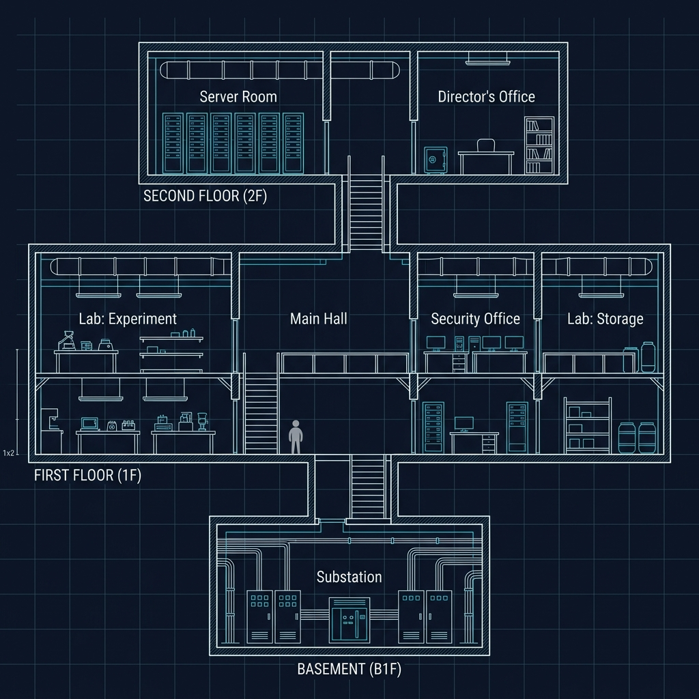
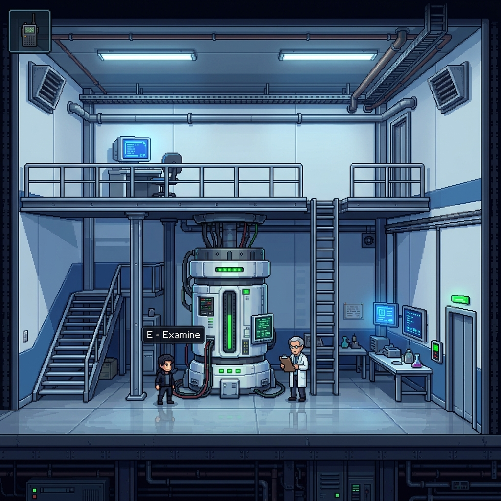

# Caretaker — Level Design Guide

| 버전 | 내용 | 작업자 |
| :---: | :---: | :---: |
| 260504 | 초안 작성 | 유민서 |

---

## 1. 설계 철학

### 1.1 맵 구조: 시설 단면도(Cross-Section) 기반 룸 연결

연구소 건물을 **옆에서 잘라본 단면도**로 구성한다. 각 **방(Room)** 이 하나의 게임플레이 단위이며, 방과 방은 문·복도·계단·덕트로 연결된다.

- ❌ 산나비식 대형 연속 맵 — 인과 변화를 알아채기 어렵고, 소통 시 위치 설명이 모호해짐
- ❌ 메트로배니아식 자유 탐색 — 페이즈 구조와 충돌, 6명 팀으로 맵 규모 감당 불가
- ❌ 횡스크롤 액션(Mark of the Ninja) — 솔로 스텔스에 최적화된 구조, 협동 퍼즐이 안 붙음
- ✅ **빌딩 침투형 룸 연결** — 방 이름이 곧 좌표, 인과 변화가 즉시 가시적, 소통 친화적

### 1.2 카메라: 방 내부 시점

TWOM처럼 건물 전체를 조감하는 것이 **아니다.** 카메라는 현재 방의 내부만 보여준다.

| 항목 | 설계 |
|------|------|
| 시점 | 방 내부, 2D 사이드뷰 |
| 카메라 이동 | 방 크기 ≤ 1.5 뷰포트면 고정, 초과 시 플레이어 추적 |
| 방 전환 | 문/계단 진입 시 화면 전환 (페이드 또는 슬라이드) |
| 전체 맵 | 플레이어에게 보이지 않음 → 머릿속으로 조립해야 함 |

**이점:** 전체 구조가 안 보이므로 "내가 어디야"를 상대에게 말로 설명해야 함 → 소통의 필요성이 자연스럽게 발생.

### 1.3 미니맵

**각자 방문한 방만 표시되는 비대칭 미니맵** 권장. 상대가 방문한 영역은 안 보임 → 미니맵 자체가 비대칭 정보.

### 1.4 탐색의 정의

이 게임에서 "탐색"은 3가지의 합이다:

| 탐색 유형 | 행동 | 레퍼런스 |
|----------|------|---------|
| **실험** | 인과 트리거를 조작하고 미래에서 결과를 확인 | The Swapper |
| **관찰 → 계획** | 방의 구조·AI를 파악하고 행동 순서를 결정 | Abe's Oddysee |
| **교차 해석** | 과거에서 본 것과 미래에서 본 것을 합쳐 전체 그림을 완성 | Fez, 고유 메커니즘 |

> 화면에서 뭘 하느냐보다, **마이크로 뭘 말하느냐**가 이 게임의 핵심이다.

---

## 2. 시설 구조

### 2.1 전체 배치



```
┌─────────────────────────────────────────────────────┐
│ 2F                                                  │
│  ┌──────────┐    ┌────────┐    ┌──────────────┐     │
│  │  서버실   │◄───│  복도   │───►│  연구소장실   │     │
│  │(카드키잠금)│    │(계단↕)  │    │  (금고,PC)   │     │
│  └──────────┘    └───┬────┘    └──────────────┘     │
│                      │                               │
├──────────────────────┼──────────────────────────────┤
│ 1F                   │                               │
│  ┌─────────┐  ┌──────┴─────┐  ┌──────┐  ┌────────┐ │
│  │연구동    │──│  연구소     │──│보안실 │  │연구동   │ │
│  │:실험실   │  │  내부(로비) │  │      │  │:저장소  │ │
│  └─────────┘  └──────┬─────┘  └──────┘  └────────┘ │
│                      │                               │
│               ┌──────┴─────┐                         │
│               │ 연구소 입구  │  ← 시작 지점            │
│               └──────┬─────┘                         │
│                      │                               │
├──────────────────────┼──────────────────────────────┤
│ B1F                  │                               │
│               ┌──────┴─────┐                         │
│               │   변전실    │                         │
│               └────────────┘                         │
└─────────────────────────────────────────────────────┘
```

### 2.2 방 목록

| 방 | 층 | 크기 유형 | 주요 역할 | 수직 구조 |
|-----|-----|----------|----------|----------|
| 연구소 입구 | 1F | S | 시작 지점, 튜토리얼 | 없음 (1층위) |
| 연구소 내부 (로비) | 1F | L | 허브, 방향 기준점 | 없음 (1층위) |
| 보안실 | 1F | M | 협동 퍼즐 (M2), AI 회피 | 서버랙 + 캣워크 (3층위) |
| 연구동: 실험실 | 1F | M | 협동 퍼즐 (M3), 조합 실험 | 관측 메자닌 (2층위) |
| 연구동: 저장소 | 1F | M | 협동 퍼즐 (M4), 실린더 회수 | 선반 단위 (2층위) |
| 복도/계단 | 각 층 | S | 연결, AI 패트롤, 은신 구간 | 없음 (1층위) |
| 변전실 | B1F | M | 협동 퍼즐 (M1), 전력 복구 | 배관 (2층위) |
| 서버실 | 2F | M | 청사진 확보 | 이중바닥 + 서버랙 (3층위) |
| 연구소장실 | 2F | M | 카드키 획득, 금고 퍼즐 | 없음 (1층위) |

---

## 3. 방 설계 기준

### 3.1 기본 단위

DRD Specification에서 역산:

| 항목 | 값 |
|------|-----|
| 캐릭터 크기 | 1×2 units |
| 이동 속도 | 5 units/sec |
| 점프 높이 | 2 units |
| 상호작용 반경 | 1 unit |
| AI 감지 거리 | 10 units |
| AI 시야각 | 45° |
| **카메라 뷰포트 (추정)** | **20×11 units** |

### 3.2 크기 분류

| 유형 | 크기 (units) | 화면 수 | 용도 | 횡단 시간 |
|------|-------------|---------|------|----------|
| **S** | 10~15 × 11 | 0.5~0.75 | 복도, 계단, 덕트 | 2~3초 |
| **M** | 20~30 × 11~14 | 1~1.5 | 퍼즐 방, 보안실, 변전실 | 4~6초 |
| **L** | 30~40 × 14~16 | 1.5~2 | 로비, 대형 실험실 | 6~8초 |
| **XL** | 50~60 × 11 | 2.5~3 | Phase 3 탈출 전용 | 10~12초 |

**AI 감지 거리(10u)가 핵심 기준.** M 사이즈(25u) 방에서 AI 한 명은 방의 40%만 커버 → 나머지 60%에 은신/우회 여지.

### 3.3 수직 층위 원칙

모든 M 이상 방에 **최소 2개 층위**를 만든다.

```
┌──────────────────────────────────────┐
│ ③ 상층 (8~10u) ── 덕트, 완전 안전     │
│    ┌─────────┐                       │
│    │ 환기 덕트 │─ ─ ─ ─ ─ ─ ┐        │
│    └─────────┘              │        │
│                       ┌─────┴───┐    │
│ ② 중층 (3~5u) ── 캣워크 │ 플랫폼  │    │
│    ┌──────┐           └─────────┘    │
│    │가구/랙│ ← 시야 차단 + 발판        │
│    │(2~3u)│                          │
│ ① 지상 (0u)└──────┘                    │
│ 🧑 ▓▓▓▓▓▓▓▓▓▓▓▓▓▓▓▓▓▓▓▓▓▓▓▓▓▓▓▓▓▓│
└──────────────────────────────────────┘
```

| 층위 | 높이 | 역할 | 접근 방법 | 얻는 것 | 잃는 것 |
|------|------|------|----------|---------|---------|
| ① 지상 | 0u | 이동, AI 패트롤, 상호작용 | 기본 | 오브젝트 접근 | AI 노출 |
| ② 중층 | 3~5u | 엄폐, 시야 차단, 발판 | 점프(2u) + 가구 경유 | AI 시야 회피 | 올라가는 순간 노출 |
| ③ 상층 | 8~10u | 우회, 다른 방 연결 | 사다리/덕트 | 완전 안전 | 오브젝트 접근 불가, 느림 |

**점프(2u)로는 중층까지만.** 상층은 반드시 중간 경유 필요 → 경로 선택에 시간 비용.


### 3.4 연구소에서의 수직 요소

**과거 (정상 운영):**

| 요소 | 높이 | 설명 |
|------|------|------|
| 관측 메자닌 | 방 절반 높이 | 대형 실험실의 관찰 플랫폼 |
| 정비용 캣워크 | 천장 근처 | 배관·조명 정비용 금속 통로 |
| 서버랙 | 캐릭터 1.5배 | 시야 차단, 위에 물건 배치 가능 |
| 이중바닥 (Raised Floor) | 바닥 아래 | 서버실 케이블 공간, 패널 개방 가능 |
| 환기 덕트 | 천장 내부 | 잠겨있거나 덮개로 막혀있음 |

**미래 (폐허) — 새롭게 생기는 수직 요소:**

| 요소 | 원인 | 게임플레이 |
|------|------|----------|
| 무너진 바닥/천장 | 구조물 노후화 | 수직 숏컷, 아래층 진입 |
| 잔해 경사로 | 콘크리트·장비 붕괴 | 과거에 없던 높이 도달 |
| 뿌리/덩굴 | 식물 침투 | 등반 가능 표면 |
| 넘어진 장비 | 고정 해제 | 경사로, 새 발판 |
| 노출 골조 | 벽 박리 | 철근·파이프가 발판 |

> **핵심:** 과거에서 접근 가능한 높이와 미래에서 접근 가능한 높이가 **다르다.** 이 차이 자체가 인과 메커니즘의 기반.

---

## 4. 구조물 배치 원칙

### 4.1 시야 차단 블록을 방 중앙에

AI FOV(10u, 45°)를 차단하는 키 큰 오브젝트(서버랙, 책장 등)를 방 중앙에 놓아 2개 영역으로 분할.

```
[보안실 — 30×11u]

   경비원 ←→ 패트롤
┌──────────────────────────────────┐
│  📺모니터     ║서버║         🔒금고 │
│  📺데스크     ║랙 ║   📦상자       │
│ 🧑‍✈️경비       ║(시야║차단)   ☐ 단서  │
│▓▓▓▓▓▓▓▓▓▓▓▓▓║▓▓▓║▓▓▓▓▓▓▓▓▓▓▓▓▓│
└──────────────────────────────────┘
  ◄── 위험 ──►       ◄── 안전 ──►
```

### 4.2 이동 비용으로 선택지 형성

같은 목적지에 2~3개 경로. 각 경로에 다른 비용:

| 경로 | 속도 | 위험도 | 트레이드오프 |
|------|------|--------|------------|
| ① 지상 직진 | 빠름 (4초) | 높음 | AI 시야 통과 |
| ② 중층 우회 | 보통 (6초) | 중간 | 점프 필요, 일부 노출 |
| ③ 상층 덕트 | 느림 (8초) | 낮음 | 사다리 접근 시 잠깐 노출 |

### 4.3 엄폐물 크기 기준

| 오브젝트 | 크기 | 역할 |
|---------|------|------|
| 낮은 상자/의자 | 1×1u | 발판 전용. AI 시야 차단 안 됨 |
| 책상/테이블 | 2×1u | 아래에 숨기 가능 |
| 서버랙/책장 | 2×3u | **핵심 시야 차단 블록** |
| 대형 장비/기둥 | 3×4u+ | 방 분할용. 완전 은신 |

---

## 5. 인터랙티브 오브젝트

### 5.1 분류

| 유형 | 설명 | 예시 | 상호작용 |
|------|------|------|---------|
| **인과 트리거** | 과거 전용. 미래에 물리적 변화 유발 | 배전반 레버, 상자 밀기, 바닥 파괴 | 1u 접근 + E키 |
| **정보 오브젝트** | 읽기/확인 전용 | 문서, 모니터, 칠판, 명찰 | 1u 접근 + E키 |
| **기계 오브젝트** | 즉각 효과 (문, 잠금 등) | 문 스위치, 엘리베이터, 잠금장치 | E키, 아이템 필요 가능 |
| **획득 오브젝트** | 인벤토리에 들어감 | 카드키, 배터리, 케이블 | 자동 또는 E키 |

### 5.2 배치 규칙

**① 방당 3~5개 이내.**
음성으로 상대에게 방 상황을 설명해야 함. 오브젝트가 5개를 초과하면 소통이 과부하됨.

| 방 크기 | 오브젝트 수 |
|---------|-----------|
| S (연결) | 0~1개 |
| M (퍼즐) | 3~4개 |
| L (탐색) | 4~5개 |

**② 인과 트리거는 위험한 위치에.**
무비용으로 접근 가능하면 안 됨. AI 근처, 높은 곳, 우회해야 하는 위치에 배치.

**③ 정보 오브젝트는 주 동선 70%, 보조 동선 30%로 분산.**
핵심 정보는 지나가다 발견. 보충 정보는 탐색을 보상.

**④ 인과 트리거의 결과는 같은 방 또는 인접 방에서 확인 가능하게.**
과거 A방에서 트리거 → 미래 C방에서 변화 = 미래 플레이어가 변화를 알아채지 못함.

---

## 6. 협동 퍼즐 설계

### 6.1 퍼즐 유형 분류

| 유형 | 설명 | 예시 |
|------|------|------|
| **A. 정보 교환형** | 한쪽만 볼 수 있는 단서를 전달 | 과거 칠판 수식 → 미래에서 입력 |
| **B. 물리 인과형** | 과거의 물리적 행동이 미래 지형 변경 | 상자 이동 → 미래에서 발판 |
| **C. 동시 행동형** | 양쪽이 동시에 각자 역할 수행 | 레버 유지 + 열린 문 통과 |
| **D. 트레이드오프형** | 한쪽 이득이 다른 쪽 위험 증가 | 전력 복구 → 보안 시스템 재가동 |

### 6.2 교차 배치 원칙

> **동일 유형의 퍼즐을 연속 배치하지 않는다.**

| 미션 | 권장 유형 조합 |
|------|--------------|
| M1 (전력 복구) | B + C (물리 인과 + 동시 행동) |
| M2 (네트워크 침입) | A + D (정보 교환 + 트레이드오프) |
| M3 (청사진 식별) | A + B (정보 교환 + 물리 인과) |
| M4 (실린더 회수) | C + D (동시 행동 + 트레이드오프) |

### 6.3 인과 메커니즘의 수직 활용

높이를 바꾸는 행위 자체가 인과 트리거가 될 수 있다:

| 과거 행동 | 미래 결과 |
|----------|----------|
| 캣워크 사다리 잠금 해제 | 미래에서 사다리 사용 가능 |
| 바닥 패널 개방 | 미래에서 아래층 진입로 |
| 장비 고정 볼트 해제 | 미래에서 장비 넘어져 경사로 |
| 덕트 뚜껑 개방 | 미래에서 덕트 경로 사용 가능 |
| 천장에 과부하 | 미래에서 천장 붕괴 → 새 수직 통로 |

---

## 7. 과거/미래 시각 차별화




### 7.1 시각 대비 기준

| 요소 | 과거 | 미래 |
|------|------|------|
| **조명** | 형광등, 밝고 균일 | 비상등 + 생물발광, 어둡고 불균일 |
| **색온도** | 차가운 흰색/강철 블루 | 딥 틸/러스트 오렌지/에메랄드 |
| **벽/바닥** | 깨끗한 콘크리트, 유리 파티션 | 균열, 이끼, 물 웅덩이 |
| **장비** | 작동 중 (녹색 표시등) | 파손/정지 (적색 또는 꺼짐) |
| **NPC** | 연구원, 경비원 (인간) | 드론, 자동화 시스템 (기계) |
| **소리** | 기계 윙윙, 발걸음, 대화 | 물방울, 바람, 금속 삐걱임 |

### 7.2 에셋 재활용 전략

같은 방 구조(벽, 바닥, 천장 위치) 위에 타일셋·오브젝트만 교체하여 과거/미래를 구분. 구조 자체를 새로 만들지 않음.

---

## 8. 참고 게임

| 게임 | 참고 요소 | 우선순위 |
|------|----------|---------|
| **Gunpoint** | 시설 단면도 구조 + 장치 재연결 퍼즐 | ⭐ 최우선 |
| **We Were Here (1편)** | 음성 소통 퍼즐의 재미와 한계 | ⭐ 최우선 |
| **The Sexy Brutale** | 같은 공간의 시간 변화 + 인과 쾌감 | ⭐ 최우선 |
| Mark of the Ninja | AI 시야 시각화, 2D 스텔스 UX | 높음 |
| The Swapper | 2D 룸 기반 퍼즐 탐색 | 높음 |
| This War of Mine | 건물 단면도 탐색감, 수직 이동 수단 | 높음 |
| Metroid Dread | EMMI 추격 구간 설계 (Phase 3 참고) | 보통 |
| Abe's Oddysee | 스크린 단위 관찰→계획 퍼즐 | 보통 |
| The Past Within | 과거/미래 비대칭 구현, 반면교사 포함 | 보통 |

---

## 9. 화이트박싱 체크리스트

새로운 방을 설계할 때마다 확인:

- [ ] 크기가 S/M/L/XL 중 하나에 해당하는가?
- [ ] M 이상이면 최소 2개 층위가 있는가?
- [ ] AI가 있는 방이면 시야 차단 블록이 중앙 부근에 있는가?
- [ ] 2~3개의 이동 경로가 존재하며 각각 다른 비용인가?
- [ ] 인터랙티브 오브젝트가 3~5개 이내인가?
- [ ] 인과 트리거가 위험한 위치에 있는가? (무비용 접근 불가)
- [ ] 인과의 결과가 같은 방 또는 인접 방에서 확인 가능한가?
- [ ] 이 방의 내용을 음성으로 10초 안에 설명할 수 있는가?
- [ ] 캐릭터가 방을 횡단하는 데 3~8초가 걸리는가?

---

## 10. 참고 자료

- DRD §2.5 Specification
- DSD §3 세부 설계
